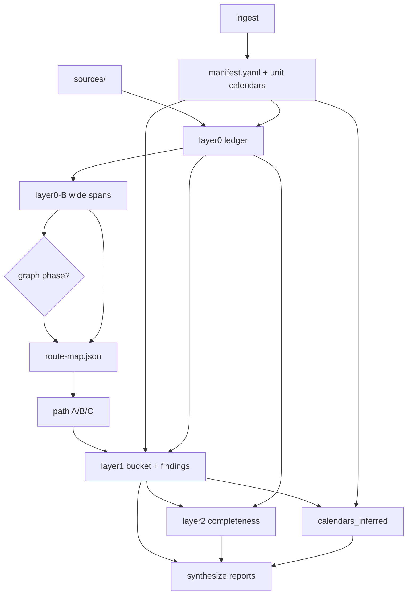

# Loom pipeline dataflow for graph insert candidates

Research asset for ticket 01. Source of truth: `run_project.py` orchestration and the scripts it invokes (read 2026-08-02). Paths are relative to `projects/<project_id>/` unless noted.

---

## Orchestration order (`run_project.py`)

```text
preflight (config.yaml health)
  → ingest? (if --ingest or no manifest)
  → rollup? (unless --skip-rollup)
  → layer0 decompose (0-A)
  → layer0 resolve-wide-spans (0-B)
  → route.py
  → workflows/run_paths.py
  → layer1.py
  → layer2.py
  → calendars.py
  → synthesize.py
  → push_drive_reports.py (optional)
```

All headline steps are skipped when `--skip-layer01` is set (rollup/ingest may still run).

---

## Step → reads → writes

### Preflight (`run_project.preflight_models`)

| Reads | Writes |
|-------|--------|
| Repo-root `config.yaml` → `models.analyst_url`, `models.verifier_url` (health GET) | — |

### Ingest (`ingest.py`) — conditional

| Reads | Writes |
|-------|--------|
| `projects/<id>/sources/**` (catalog build) | `manifest.yaml` — `project`, `sources_dir`, `units.<unit_id>.{title,calendar,documents}` |
| `config.yaml` (model organize) | `units/<unit_id>/calendar.yaml` per unit |
| | `school-calendar.yaml` (hint scaffold) |
| | `ingest/catalog.json` |
| | `ingest/.raw/organize-analyst.json`, `organize-verifier.json` |

**Key artifact:** `manifest.yaml` → `units.<id>.documents[]` is the production unit document list (basename paths into `sources/`). Ingest populates this from model organize output (`source_files` → `documents`).

### Rollup (`rollup.py`) — early / provisional

| Reads | Writes |
|-------|--------|
| `manifest.yaml` | `pacing-plan.yaml` (skipped if exists unless `--force`) |
| `school-calendar.yaml` (optional) | `output/03-year-calendar-map.json` |
| `units/<unit_id>/calendar.yaml` per manifest unit | `output/03-year-calendar-map.md` |

Labeled `source: inferred_from_documents` but **not authoritative** after assemble — `calendars.py` supersedes for post-assemble evidence calendar.

### Layer 0-A decompose (`layer0.py` — default run)

| Reads | Writes |
|-------|--------|
| `--sources` dir (default `projects/<id>/sources/`) | `layer0/ledger.json` — one row per instructional element (checkpointed per doc) |
| Existing `layer0/ledger.json` (resume / carry-forward) | `layer0/ledger.md`, `layer0/REPORT.md` |
| `config.yaml` | `layer0/.raw/<doc_id>-pass1.json`, `-pass2.json` (and chunk variants) |

**Ledger row keys used downstream:** `doc_id`, `source_file`, `element_id`, `element_type`, `excerpt`, paragraph cite fields, `content_hash`, `tier`.

### Layer 0-B resolve-wide-spans (`layer0.py --resolve-wide-spans`)

| Reads | Writes |
|-------|--------|
| `layer0/ledger.json` | Same `layer0/ledger.json` (split wide-span rows) |
| `sources/` (paragraph reconstruction) | `layer0/LAYER0B-REPORT.md` |

### Route (`route.py`)

| Reads | Writes |
|-------|--------|
| `layer0/ledger.json` (doc aggregation, element counts, regex priors) | `layer0/route-map.json` — `routes[]` with `doc_id`, `doc_type`, `workflow_id`, `path` (A/B/C), `source_file` |
| `sources/doc_*.txt` (filename type fill-in) | `_loom_feedback.yaml` (append weak/unknown types) |

Does **not** read `manifest.yaml`. Does **not** place into units.

### Path workflows (`workflows/run_paths.py`)

| Reads | Writes |
|-------|--------|
| `layer0/route-map.json` (via `routed_doc_ids`) | `path_a/findings.json`, `path_a/<doc_id>.json` |
| `layer0/ledger.json` (Path A element slices) | `path_b/findings.json` (stub inventory) |
| `sources/` (Path B text sniff; title map) | `path_c/findings.json` (stub inventory) |
| `manifest.yaml` (unit LESSON-PLAN refresh) | `layer0/workflow-handoff.json` |
| `config.yaml` (Path A A6 model place, optional) | `output/teachers/<unit_id>/LESSON-PLAN.{md,json,pdf}` |

Path A/B/C findings are **parallel audit inventories** — lesson-plan hunter matrix, quiz stub, general stub. They do not feed Layer 1 bucket logic directly (synthesize optionally surfaces Path A in SUMMARY / first-pass).

### Layer 1 (`layer1.py`)

| Reads | Writes |
|-------|--------|
| `manifest.yaml` — units, `documents`, `known_overlaps`, parent links via manifest | `layer1/bucket-ledger.json` — one row per Layer 0 element + placement |
| `layer0/ledger.json` | `layer1/findings.json` — one row per (unit, day, role) fulfillment |
| `layer0/route-map.json` (**soft gate** — unrouted docs quarantined) | `layer1/REPORT.md`, `layer1/REVIEW-QUEUE.md` |
| `units/<unit_id>/calendar.yaml` per unit | `layer1/unrouted-quarantine.json` (when gate fires) |
| Existing `layer1/*` (carry-forward on `--only-unit`) | `layer1/.raw/<doc_id>-phase1.json`, `<element_id>-recheck.json`, `<unit>-<day>-phase3.json` |

Scoped by `--only-unit` via manifest `units.<id>.documents` → doc_id set.

### Layer 2 (`layer2.py`)

| Reads | Writes |
|-------|--------|
| `layer0/ledger.json` | `layer2/findings.json` — per (doc_id, role) structural completeness |
| `layer1/findings.json` (FULFILLED rows only) | `layer2/REPORT.md` |
| `manifest.yaml` (unit document scope for `--only-unit`) | |

Zero new model calls — checklist against ledger excerpts for docs Layer 1 already confirmed fulfill a role.

### Calendars (`calendars.py`)

| Reads | Writes |
|-------|--------|
| `manifest.yaml` | `calendars_inferred/INFERRED-CALENDARS.json` |
| `layer1/findings.json` (FULFILLED/DUPLICATE/MATCH per unit/day) | `calendars_inferred/INFERRED-CALENDARS.md` |
| `units/<unit_id>/calendar.yaml` (preserve day ids) | |
| `config.yaml` (optional `--model-note` year summary) | |

Authoritative **post-assemble** inferred calendar; does not mutate unit YAML calendars.

### Synthesize (`synthesize.py` → `reports.py`)

| Reads | Writes |
|-------|--------|
| `manifest.yaml` | `output/FIRST-PASS.md`, `output/GLOBAL-AUDIT.md` (alias) |
| `layer1/bucket-ledger.json`, `layer1/findings.json` | `output/GLOBAL-AUDIT-REPORT.pdf` (via render) |
| `layer2/findings.json` (optional degrade) | `output/DASHBOARD.md`, `output/SUMMARY.md` |
| `pacing-plan.yaml`, `school-calendar.yaml` | `output/aggregate-stats.json` |
| `path_a/findings.json`, `output/teachers/*/LESSON-PLAN.json` (optional enrich) | `output/teachers/<unit_id>/TEACHER-PACKET.md` (+ PDF) |
| `layer1/REVIEW-QUEUE.md` source data | `output/REVIEW-QUEUE.md` (breadcrumb) |
| `config.yaml` (model delivery narrative) | `output/synthesize/.raw/<report>/pack.json` (first-pass) |

Planned report id `document` (not yet implemented) would need layer0+1+2 — natural future consumer of graph HAS-PART if promoted.

### Drive push (`tools/push_drive_reports.py`) — post-pipeline

| Reads | Writes |
|-------|--------|
| `output/GLOBAL-AUDIT-REPORT.pdf`, teacher PDFs | Google Drive (soft-fail) |

---

## Manifest / unit document pattern

Production shape (from `ingest.py` + fixtures):

```yaml
project:
  id: <slug>
units:
  <unit_id>:
    title: ...
    calendar: units/<unit_id>/calendar.yaml
    documents:          # ordered basename list into sources/
      - doc_<hash>_Human_Title.txt
      - ...
```

Graph spike fixture (`experiments/graphing/results/bluebonnet-g5-m1-grok/manifest.yaml`) uses the same `units.<id>.documents` key (PDF basenames). `graph_assemble.load_unit_slice()` also accepts legacy `source_files`.

Layer 1 scopes units via this list (`doc_id_from_filename` on each path). Graph narrow-steps scope per unit the same way.

---

## What `experiments/graphing` runners require

From `graph_assemble.py`, `run_bluebonnet_slice_30b.py`, `spike_loop.py`, `SPIKE.md`:

| Input | Required? | Notes |
|-------|-----------|-------|
| `manifest.yaml` with `units.<unit_id>.documents[]` | **Yes** | Unit slice registry; drives Gate A source list |
| On-disk `sources/` files matching manifest basenames | **Yes** | Gate A: every file → Material node; no orphans |
| `layer0/ledger.json` | **Yes** (30B narrow-steps path) | Sliced by `source_file`; full excerpts per element for role/lessons/assessment prompts |
| Provisional graph (`build_provisional`) | Generated | Materials-only under unit; no Lessons yet |
| Gold `HAS-PART.json` | No (scoring only) | Bluebonnet Grok gold for `score_haspart`; not a pipeline gate |
| `route-map.json`, path A/B/C findings | **No** | Not read by graph runners |
| Layer 1/2 findings | **No** | SPIKE explicitly defers L0/calendar-coupled rebuild inputs |
| `calendars_inferred/` | **No** | Future richer suite, not spike |

**Narrow-steps + `rebuild_multi` contract:**

1. Per source × 3 model steps (role → lesson numbers → assessment-bearing) using ledger evidence JSON.
2. `merge_narrow_step_findings()` — code merge using manifest unit doc list + spine policy.
3. `rebuild_multi(provisional, review-findings)` — code-owned HAS-PART graph (Lesson nodes, edges).

Outputs land under `experiments/graphing/results/<run_id>/` (`propose.json`, `review-findings.json`, `final.json`, `.raw/*`) — **not** under `projects/<id>/graph/` today.

---

## Candidate insert slots (graph phase)

Mechanical viability = ledger + manifest unit documents + sources exist; downstream layers not yet committed to conflicting organization decisions.

### Slot 1 — After Layer 0-B, **before** `route.py` ⭐ preferred

| | |
|---|---|
| **Available** | `layer0/ledger.json` (complete evidence), `manifest.yaml` + `units.*.documents`, `sources/` |
| **Not yet written** | `route-map.json`, path findings, all Layer 1/2 artifacts |
| **Pros** | Matches standing preference (“after Layer 0 evidence”; graph before router per `GRAPHING.md` / map Notes). Graph belonging (Materials→Lessons→Assessments) runs before Path A/B/C peer typing. No coupling to route soft-gate or L1 placement. Narrow-steps path is fully fed. |
| **Cons** | No `doc_type` / workflow hints from route-map (graph uses filename priors + ledger instead — same as Bluebonnet runner). Path workflows and L1 cannot consume graph output without a later merge contract. |

### Slot 2 — After `route.py`, before `workflows/run_paths.py`

| | |
|---|---|
| **Available** | Everything in Slot 1 + `layer0/route-map.json`, `_loom_feedback.yaml` |
| **Pros** | Optional use of `doc_type` / path priors for narrow-step prompts; still before path workflows and all placement layers. |
| **Cons** | Route-map encodes filename heuristics graph is meant to complement/replace for organization; risk of treating Path letter as structural truth. Path A/B/C still parallel — graph output unused unless wired. |

### Slot 3 — After path workflows, before `layer1.py`

| | |
|---|---|
| **Available** | Slot 2 + `path_a/b/c/findings.json`, `workflow-handoff.json`, LESSON-PLAN plates |
| **Pros** | Could cross-check graph Assessment attachment vs Path A hunter / Path B quiz inventory. |
| **Cons** | Path findings are lesson-plan / quiz **audit**, not HAS-PART organization — weak mechanical coupling. L1 starts immediately after; graph would not affect L1 without retroactive merge. Extra latency before placement conformance. |

### Slot 4 — After Layer 1, before Layer 2

| | |
|---|---|
| **Available** | Full placement bucket + role fulfillment findings |
| **Pros** | Graph could annotate misplacement or cross-unit overlap. |
| **Cons** | **Poor fit for insert.** L1 already decided element→unit/day/role using manifest parent links + route gate. Graph answers a different question (instructional organization tree). Running here cannot revise L1 inputs; would only produce parallel artifacts for synthesize. |

### Slot 5 — After Layer 2 or calendars, before synthesize

| | |
|---|---|
| **Available** | Complete L1/L2 + inferred calendars |
| **Pros** | Easy to add HAS-PART section to reports without blocking pipeline. |
| **Cons** | Too late to influence conformance globals. Calendars already derived from L1 findings — graph cannot inform inferred day grid. Reporting-only slot. |

### Not viable

| Slot | Why |
|------|-----|
| Before Layer 0-A | No `ledger.json` — narrow-steps hard-fail (`load_full_doc_evidence`) |
| Before ingest (no manifest) | No `units.*.documents` — `load_unit_slice` fails |
| Replacing Layer 2 | Different job (structural completeness vs belonging graph); map Out of scope |

---

## Graph phase minimum inputs (production merge checklist)

When promoting from `experiments/graphing` into `run_project.py`, the graph phase **must** have:

1. **`projects/<id>/layer0/ledger.json`** — post 0-A and preferably post 0-B (clean single-purpose excerpts).
2. **`projects/<id>/manifest.yaml`** — at least one unit with non-empty `documents[]` (and optional `spine_policy` per unit or manifest root).
3. **`projects/<id>/sources/`** — every manifest document basename present on disk (Gate A).
4. **`config.yaml`** — analyst endpoint for narrow model steps (same as Layer 0/1).
5. **Unit id scope** — explicit `--only-unit` or iterate manifest units (multi-unit projects must pass `unit_id`; spike default-first-unit is not production-safe).

**Optional / not required at insert:** gold graph, `route-map.json`, path A/B/C findings, Layer 1/2 findings, `calendars_inferred/`, `pacing-plan.yaml`.

**Suggested on-disk outputs (to be locked in ticket 05):** e.g. `graph/HAS-PART.json`, `graph/review-findings.json`, `graph/.raw/<source_stem>.json` under the project root — mirroring spike layout but namespaced per project, not under `experiments/graphing/results/`.

---

## Dependency sketch



Graph slot ⭐ = edge `L0B → G → route` (or `G` parallel between `L0B` and `paths` if route stays first).
