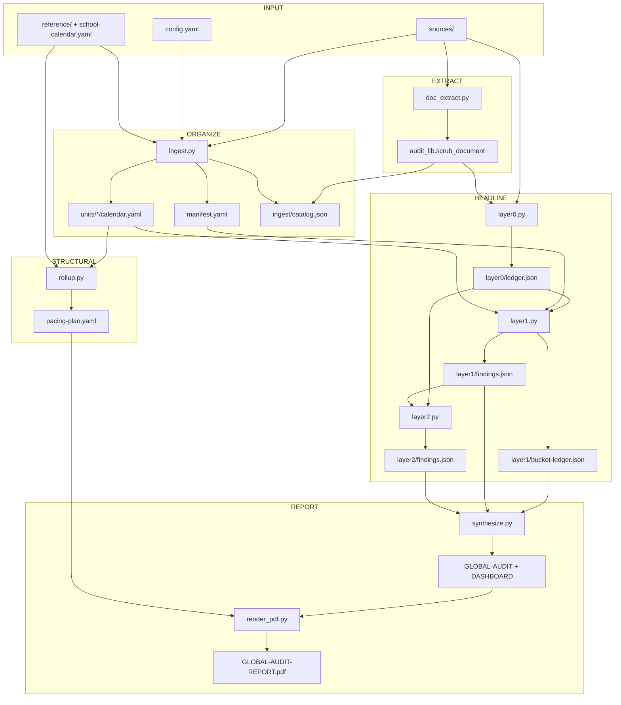

# DEPENDENCY_FLOW — Data Lineage & Blast Radius

**Purpose:** Directed lineage so any change’s blast radius is explicit.  
**Notation:** `A → B` means B reads A (or is produced from A).  
**Rule:** Before editing a pivot file, you MUST read the blast-radius section for that node.

---

## 1. End-to-end lineage

```text
[Human] curriculum files
    → projects/<id>/sources/
        → doc_extract.py / audit_lib.scrub_document
            → ingest/catalog.json
                → ingest.py (models)
                    → manifest.yaml
                    → units/*/calendar.yaml
                        → rollup.py
                            → pacing-plan.yaml
                            → output/03-year-calendar-map.{md,json}

sources/
    → layer0.py  (0-A: decompose → verbatim, contiguous citations)
        → layer0/ledger.json
            → layer0.py --resolve-wide-spans  (0-B: split over-broad wide-span
                                                citations; rewrites ledger.json)
                → layer1.py (+ manifest.yaml + units/*/calendar.yaml + known_overlaps)
                → layer1/bucket-ledger.json
                → layer1/findings.json
                → layer1/REVIEW-QUEUE.md
                    → layer2.py (+ layer0/ledger.json re-read; zero new model calls)
                    → layer2/findings.json
                    → layer2/REPORT.md
                        → synthesize.py
                            → output/FIRST-PASS.md
                            → output/GLOBAL-AUDIT.md   (alias of first-pass)
                            → output/DASHBOARD.md
                            → output/teachers/*/TEACHER-PACKET.md
                            → output/aggregate-stats.json
                                → render_pdf.py
                                    → output/GLOBAL-AUDIT-REPORT.pdf
                                    → (optional) tools/push_drive_reports.py
```

Doc-level scrub→place is archived under `archive/legacy-unit-audit/` and is not in this lineage.
---

## 2. Mermaid — production dependency graph



---

## 3. Module → module import / call graph (orchestration)

```text
run-audit <dataset-id>
  → run_project.py
      → ingest.py          (optional --ingest / missing manifest)
      → rollup.py          (unless --skip-rollup)
      → layer0.py                       (0-A decompose, unless --skip-layer01)
      → layer0.py --resolve-wide-spans  (0-B citation precision, same gate)
      → layer1.py                       (unless --skip-layer01)
      → layer2.py                       (lesson structural completeness, same gate, zero new model calls)
      → synthesize.py      (Layer-1 + Layer-2-backed globals + global PDF)
```

Shared libraries (widest code blast radius):

```text
audit_lib.py ← ingest, layer0, layer1, synthesize, run_*, inbox-watch, tests
schema_validate.py ← ingest, layer0, layer1, tests
doc_extract.py ← audit_lib, ingest path, layer0, tests
report_lib.py ← render_pdf (archived unit PDF helpers)
```

---

## 4. Pivot points — blast radius tables

### 4.1 `projects/<id>/sources/` (add/remove/rename files)

| Downstream | Effect |
|------------|--------|
| `ingest/catalog.json` | Stale until re-ingest |
| `manifest.yaml` / calendars | Wrong unit membership until `--ingest --force` |
| `layer0/ledger.json` | Missing/extra elements until Layer 0 re-run |
| All Layer 1 + globals | Invalid until Layer 0→1→synthesize cascade |

**SOP:** After source changes → `run_project.py --ingest --force` (runs Layer 0→1→synthesize unless skipped).

### 4.2 `doc_id` / filename convention

| Downstream | Effect |
|------------|--------|
| Evidence filenames | Key mismatch |
| Layer 0 `element_id` prefix | New IDs → Layer 1 cache miss / duplicate history |
| Findings `fulfilled_by` | Broken FK references |

**MUST NOT** rename the hex portion of `doc_<hex>_…` without treating it as a new document.

### 4.3 `manifest.yaml`

| Downstream | Effect |
|------------|--------|
| Layer 1 closed vocabulary | Unknown `unit_id` → validation / UNVERIFIED / ORPHAN surge |
| `known_overlaps` | Changes EXPECTED_OVERLAP vs MISMATCH |
| synthesize unit rollups | Dashboard rows appear/disappear |
| ingest consumers | Unit set definition |

**Blast radius:** High — treat as a schema-bearing registry.

### 4.4 `units/*/calendar.yaml`

| Downstream | Effect |
|------------|--------|
| `rollup.py` / pacing-plan | Year map shifts |
| Layer 1 findings | MISSING/FULFILLED flip when `expected[]` changes |
| _(archived)_ `place.py` gaps | Tier A/B recommendations change — only if you run the archived legacy path, not `./run-audit` |

### 4.5 `layer0/ledger.json`

| Downstream | Effect |
|------------|--------|
| Entire Layer 1 | Must re-run |
| Layer 2 (`element_type` presence checks read this directly, not just via Layer 1) | Must re-run |
| synthesize globals | Stale until Layer 1→2→synthesize |
| GOLDEN.json comparisons | Metric drift (both layer1 and nested layer2 keys) |

**MUST NOT** hand-edit. Re-run `layer0.py`. A non-conformant `element_type`
(outside `schema_validate.ELEMENT_TYPES`) here is itself a bug, not valid data
— see `layer0.coerce_element_type` and docs/BETS.md Bet 14; ledgers built
before that fix may still contain legacy `"|"`-joined values, which
`layer2._element_types()` reads defensively but a fresh `layer0.py` run would
clean up properly.

### 4.6 `layer1/bucket-ledger.json` + `findings.json`

| Downstream | Effect |
|------------|--------|
| `GLOBAL-AUDIT.md` / `DASHBOARD.md` | Direct |
| Layer 2 (`findings.json`'s FULFILLED rows select which documents get checked) | Must re-run |
| `GOLDEN.json` | Snapshot drift |
| Director decisions | Operational |

**MUST NOT** hand-edit JSON. Use `REVIEW-QUEUE.md` + `known_overlaps` for human calibration, then re-run Layer 1 (then Layer 2).

### 4.6a `layer2/findings.json`

| Downstream | Effect |
|------------|--------|
| `GLOBAL-AUDIT.md`'s "Lesson structural completeness" section / `DASHBOARD.md`'s completeness row | Direct |
| `GOLDEN.json` (`layer2` nested key) | Snapshot drift |

**MUST NOT** hand-edit JSON. Re-run `layer2.py` (no model calls, cheap) after any
Layer 0 or Layer 1 change. Changing `ROLE_EXPECTED_COMPONENTS` requires a
Layer 2 re-run only — Layer 0/1 stay valid.

### 4.7 `schema_validate.py` enums

| Downstream | Effect |
|------------|--------|
| All model JSON acceptance | Hard fail or silent reject |
| Calendars with new roles | Invalid until enum extended |
| Layer 0 taxonomy | Requires full Layer 0 re-extract if types change |

### 4.8 `config.yaml` model URLs

| Downstream | Effect |
|------------|--------|
| ingest / place / layer0 / layer1 | Timeouts, empty JSON, quality collapse |
| No code path change | Failures look like “data” bugs |

**SOP:** Health-check endpoints before blaming ledgers (`OPERATORS.md`).

### 4.9 `audit_lib.py`

| Downstream | Effect |
|------------|--------|
| Nearly all stages | Path resolution, scrub, model_chat, doc_id |

**Blast radius:** Maximum among libraries — require tests (`test_audit.py`, `test_doc_extract.py`).

---

## 5. Project-to-project isolation

```text
projects/A/*  ↛  projects/B/*
```

Projects share **code** and **config**, not data.  
**MUST NOT** hardcode `dallas-career-2026` paths inside production stages (tests may use it as golden fixture).

| Project | Depends on code | Produces |
|---------|-----------------|----------|
| `dallas-career-2026` | Full pipeline | DISD career / CTE (Active) |
| `region10-career-college-2026` | Full pipeline | Active dataset |
| `ap-csp-2026` | Layer 0 (+ legacy) | Stress dataset |
| `openscied-6` | Legacy + `experiments/openscied` | Experiment dataset |
| `_fixtures/ingest-pilot` / `ingest-test` | ingest only | Smoke fixtures |

---

## 6. Change impact matrix (quick)

| If you change… | Re-run at minimum |
|----------------|-------------------|
| One source file | Layer 0 (doc) → Layer 1 → Layer 2 → synthesize |
| Many sources / org | `--ingest --force` → rollup → Layer 0 → Layer 1 → Layer 2 → synthesize → PDF |
| Calendar expected roles | Layer 1 → Layer 2 → synthesize |
| `known_overlaps` | Layer 1 → Layer 2 → synthesize |
| Taxonomy / element schema | Full Layer 0 → Layer 1 → Layer 2 → synthesize + update DATA_MAP |
| `ROLE_EXPECTED_COMPONENTS` (layer2.py) | Layer 2 only → synthesize |
| `synthesize.py` only | synthesize → PDF |
| `render_pdf.py` only | PDF |
| `tools/*` | Nothing in production |

---

## 7. Orphan & stale-artifact risks

| Symptom | Likely broken edge |
|---------|-------------------|
| synthesize says run layer1 first | `layer1/bucket-ledger.json` missing |
| Dashboard empty / all UNVERIFIED | Layer 0 empty or Layer 1 not run after ledger change |
| "Lesson structural completeness" section says Layer 2 hasn't run | `layer2/findings.json` missing (synthesize degrades gracefully, not a hard error) |
| Layer 2 shows a document "missing" a part you can see is actually there | Legacy pre-fix ledger with a `"|"`-joined `element_type` on a DIFFERENT element than expected, or a genuinely absent element_type for that part — check `layer0/ledger.json` directly, see Bet 14 |
| Stale `output/<unit>/AUDIT-REPORT.pdf` | Archived scrub→place artifacts left on disk — not produced by `./run-audit` |
| Duplicate doc_ids | Filename convention collision |
| MISSING spike after “good” run | Calendar `expected[]` expanded without new elements |

---

## 8. Maintenance rule

Any PR that adds a stage or artifact MUST add a lineage arrow to **§1** and a blast-radius subsection under **§4**.
