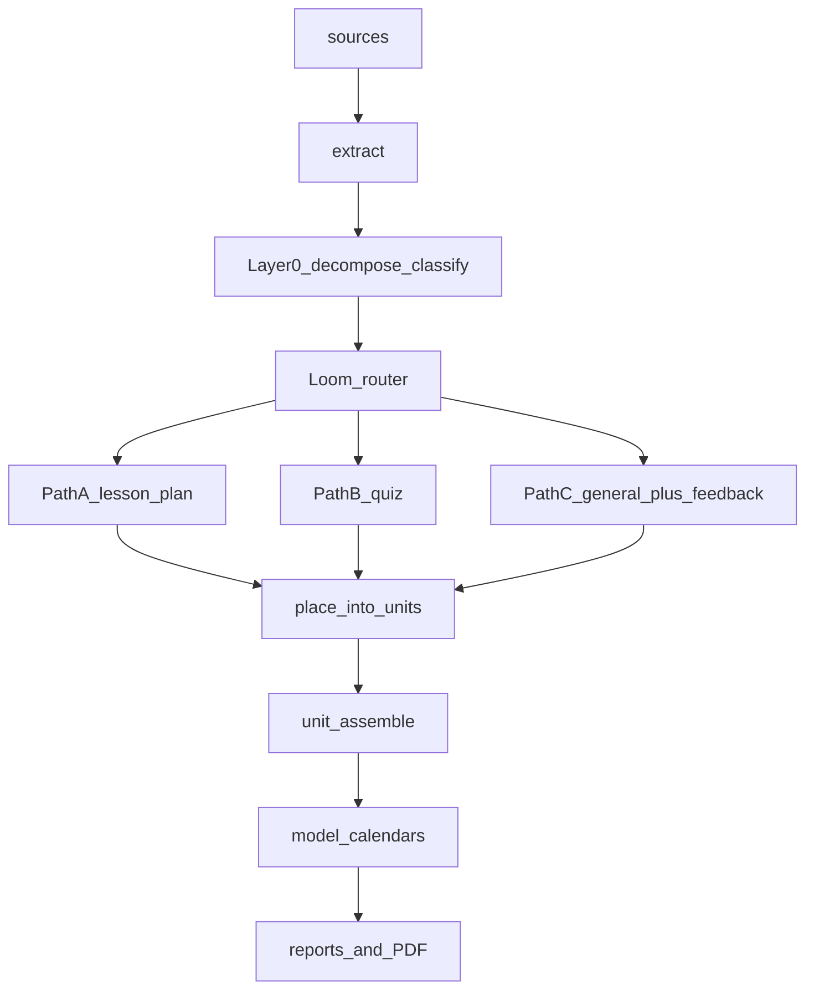

# Loom

**A local-first curriculum auditor that knows what it's reading.**

Loom ingests a pile of curriculum documents (lesson plans, worksheets, exit
tickets, assessments, frameworks), reads each one in full with a local LLM,
classifies its pedagogical type, then **routes** each document through a
type-specific workflow before checking placement, pacing, and gaps. It reports
what is present, missing, or misplaced — and never authors curriculum content.

> Loom is the evolution of the **Crystallize** auditor. Crystallize classified
> documents but then ran the *same* generic analysis on everything. Loom adds a
> router so lesson plans, quizzes, and general docs each get the right workflow.
> Loom supersedes and replaces Crystallize.

---

## What it does

1. **Ingest** any format (PDF, Word, slides, text, …) into per-document extracts
2. **Layer 0 — decompose + classify:** read each document in full, extract
   instructional elements with verbatim, citation-backed excerpts
3. **Router (`route.py`):** map each document's type to a workflow —
   `lesson_plan` (Path A), `quiz` (Path B), or `general` (Path C fallback).
   Unknown/weak types are logged to `_loom_feedback.yaml` as data, not lost
4. **Path workflows:** run type-specific checks; **nothing is placed into a unit
   until it has been routed**
5. **Place + assemble:** organize routed documents into units and infer module
   calendars
6. **Layer 1/2:** placement conformance (MATCH / MISMATCH / ORPHAN / …) and
   lesson structural completeness
7. **Reports:** director-ready PDF + markdown first-pass and teacher packets



## Loom vs Crystallize

| | Crystallize | Loom |
|---|---|---|
| **Decompose** | Breaks docs into chunks | Same |
| **Classify** | Identifies pedagogical types | Same |
| **Route** | No router — everything through identical layers | **Router picks a workflow per type** |
| **Analysis** | Generic questions for everything | Type-specific per workflow (Path A/B/C) |
| **Feedback** | None | Unknown types logged to `_loom_feedback.yaml` |

## Doctrine

- **Auditor only.** Loom reports structure and gaps. It **never** writes lesson
  plans, assessments, or rubrics (`policy.auditor_only: true`).
- **Evidence only.** Fill from citation-backed evidence; a blank is a real
  curriculum-gap signal, never invented content.
- **Generic fallback always works.** Unknown types route to Path C plus a
  feedback note, so a run never fails on an unrecognized document.

## Quick start

```bash
# 1. Configure your local model endpoint
cp config.example.yaml config.yaml   # edit model URLs for your box

# 2. Create a dataset from the template and add sources
cp -a projects/_template projects/my-district
# copy curriculum files into projects/my-district/sources/

# 3. Run the pipeline
./run-audit my-district
# equivalent: python3 run_project.py --project my-district
```

Loom runs against any OpenAI-compatible chat/completions endpoint
(llama.cpp `llama-server`, vLLM, etc.). See [OPERATORS.md](OPERATORS.md) for
flags, single-stage debugging, and dataset conventions.

## Docs

- [OPERATORS.md](OPERATORS.md) — commands, flags, pipeline stages
- [PLAN.md](PLAN.md) — router + Path A/B/C build order
- [docs/README.md](docs/README.md) — full documentation index
- [PROJECT_STRUCTURE.md](PROJECT_STRUCTURE.md) — repository layout
- [CONTRIBUTING.md](CONTRIBUTING.md) — rules of engagement

## License

Loom is **source-available, non-commercial**. It is licensed under the
[PolyForm Noncommercial License 1.0.0](LICENSE): you may freely use, study,
modify, and share it for any **noncommercial** purpose, including use by
schools, districts, and other educational and public institutions.

**Commercial use requires a separate license.** This is not an OSI "Open
Source" license. For commercial licensing, contact the maintainer.
