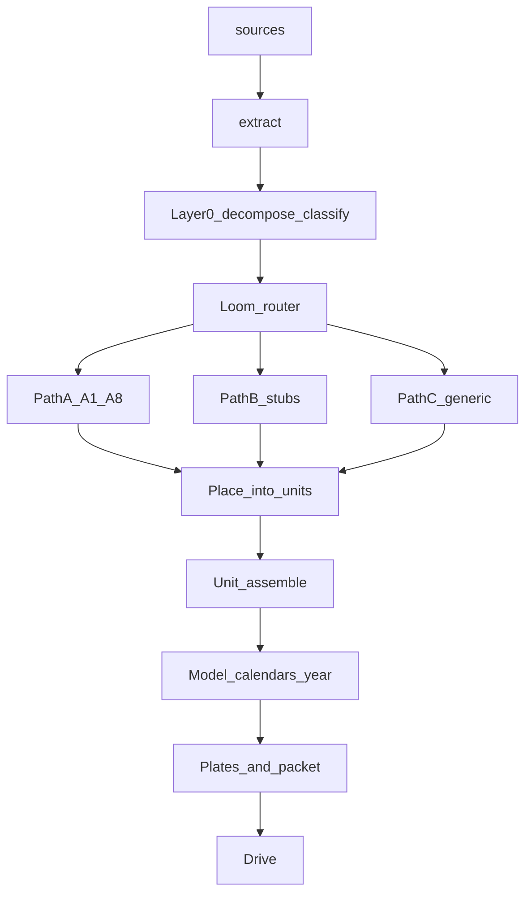

# Loom data flow — type split

Visual: [`DATA-FLOW.png`](DATA-FLOW.png). Plan: [`../PLAN.md`](../PLAN.md).

## Locked order

## Hard rules

- Nothing goes into a unit until it has passed the Loom router.
- Calendars/year are built **after** unit assemble (model), not early rollup-as-authority.
- Templates = checkboxes; blank = missing signal; never invent content.

## Paths

| Path | Types | Doc |
|------|-------|-----|
| A | `lesson_plan` | [PATH-A-LESSON-PLAN.md](PATH-A-LESSON-PLAN.md) |
| B | `quiz` / assessment | [PATH-B-QUIZ.md](PATH-B-QUIZ.md) |
| C | everything else | [PATH-C-GENERAL.md](PATH-C-GENERAL.md) |

## Handoffs

JSON Schema under [`../workflows/handoffs/`](../workflows/handoffs/).
