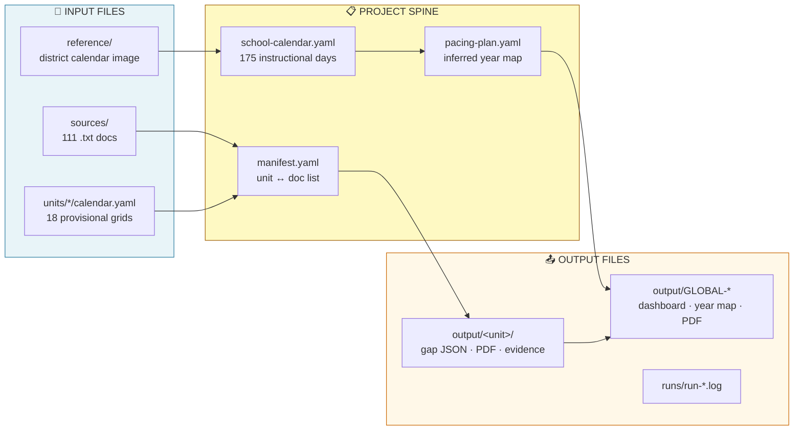
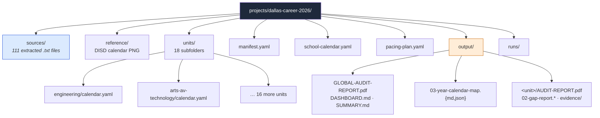
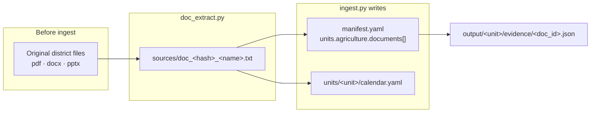
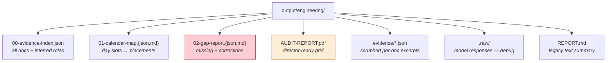
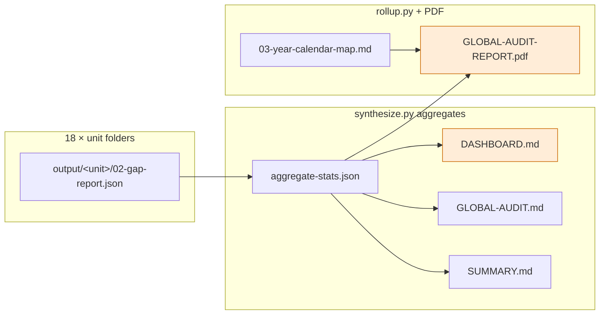
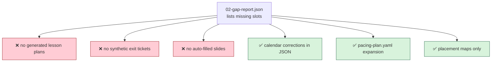

# Crystallization — File Flow Canvas

> **Archived path — not `./run-audit`.** This canvas documents the old doc-level
> scrub→place pipeline. Production is Layer 0 → Layer 1 → synthesize
> ([PIPELINE.md](PIPELINE.md)). Legacy scripts are not shipped in the public tree.
> **Not the structure source of truth** — for dirs/zones/dataset layout see
> [PROJECT_STRUCTURE.md](../PROJECT_STRUCTURE.md). Diagrams below are historical.

Companion to [DATA-FLOW.md](DATA-FLOW.md). **Data flow** = what transforms; **file flow** = where artifacts live on disk.

Copy Mermaid blocks into [mermaid.live](https://mermaid.live) to export PNG/SVG for Canva or slides.

---

## 1. High-level (one slide)

**Golden path:** `projects/dallas-career-2026/` — 111 source files in → 18 unit folders + global reports out.

---

## 2. Project directory tree (Dallas demo)

---

## 3. Source file → unit assignment

**Naming rule:** `doc_<12-char-hash>_<sanitized_title>.txt` — hash is stable doc_id used in all downstream JSON.

---

## 4. Per-unit output folder (anatomy)

Every audited unit gets the same file shape under `output/<unit-id>/`:

| Order | File | Open when… |
|-------|------|------------|
| 1 | `01-calendar-map.md` | Showing day-by-day placements |
| 2 | `02-gap-report.md` | Showing what's missing |
| 3 | `00-evidence-index.json` | Proving doc roles |
| 4 | `AUDIT-REPORT.pdf` | Director / admin view |

---

## 5. Pipeline stage → files written

```mermaid
flowchart TB
    R["run_project.py / ./run-audit"]

    R --> I["ingest.py"]
    I --> I1["manifest.yaml"]
    I --> I2["school-calendar.yaml"]
    I --> I3["units/*/calendar.yaml"]

    R --> L["rollup.py"]
    L --> L1["pacing-plan.yaml"]
    L --> L2["output/03-year-calendar-map.{json,md}"]

    R --> A["audit.py per unit"]
    A --> A1["output/&lt;u&gt;/evidence/*.json"]
    A --> A2["output/&lt;u&gt;/00-evidence-index.json"]
    A --> A3["output/&lt;u&gt;/01-calendar-map.*"]
    A --> A4["output/&lt;u&gt;/02-gap-report.*"]

    R --> S["synthesize.py"]
    S --> S1["output/GLOBAL-AUDIT.md"]
    S --> S2["output/DASHBOARD.md"]
    S --> S3["output/SUMMARY.md"]
    S --> S4["output/aggregate-stats.json"]
    S --> S5["output/batch_state.json"]

    R --> P["render_pdf.py"]
    P --> P1["output/&lt;u&gt;/AUDIT-REPORT.pdf"]
    P --> P2["output/GLOBAL-AUDIT-REPORT.pdf"]

    R --> LOG["runs/run-YYYYMMDD-HHMMSS.log"]

    classDef script fill:#dcfce7,stroke:#166534
    classDef artifact fill:#fef9c3,stroke:#a16207
    class I,L,A,S,P script
    class I1,I2,I3,L1,L2,A1,A2,A3,A4,S1,S2,S3,S4,S5,P1,P2 artifact
```

---

## 6. Global output layer (director view)

**CTAT demo open order:** `03-year-calendar-map.md` → unit PDF pair → `DASHBOARD.md` → `GLOBAL-AUDIT-REPORT.pdf`

---

## 7. What never gets written (boundary)

Gap reports **name** missing files — they do **not** create them.

---

## 8. CTAT demo — file tabs to pre-open

| Beat | File path | Why |
|------|-----------|-----|
| 1 — Year | `output/03-year-calendar-map.md` | 18 units · 39/175 days |
| 2a — Gaps | `output/engineering/02-gap-report.md` | 2 missing slots |
| 2b — Clean | `output/arts-av-technology/AUDIT-REPORT.pdf` | 0 gaps contrast |
| 3 — Dashboard | `output/DASHBOARD.md` | Systemic exit_ticket pattern |
| Backup | `output/GLOBAL-AUDIT-REPORT.pdf` | Single PDF if tabs fail |

Full project root:
`projects/dallas-career-2026/`

---

## 9. Canva build guide (file-flow poster)

| Column | Folders / files | Color |
|--------|-----------------|-------|
| **Left — In** | `sources/`, `reference/`, `units/*/calendar.yaml` | Blue |
| **Center — Spine** | `manifest.yaml`, `school-calendar.yaml`, `pacing-plan.yaml` | Gold |
| **Right — Out** | `output/<unit>/`, `GLOBAL-*`, `runs/` | Orange |
| **Callout** | Numbered outputs `00` → `02` → PDF | White boxes on orange |
| **Footer** | "Auditor writes reports, not lessons" | Red dashed |

**Arrows to label:** `ingest assigns`, `rollup maps year`, `place writes gaps`, `synthesize rolls up`

---

## 10. Three projects — file shape comparison

| Project | Input folder | Typical file count | Output highlight |
|---------|--------------|-------------------|------------------|
| `dallas-career-2026` | Many small `.txt` in `sources/` | 111 → 18 units | `DASHBOARD.md` heatmap |
| `ap-csp-2026` | 1 framework PDF | 1 doc → 5 units | Framework ≠ lesson pack |
| `openscied-6` | 7 fat TE PDFs | Sidecar JSON chain | `calendar_corrections` heavy |

Same output **shape** everywhere — only input density and experimental sidecars differ.
