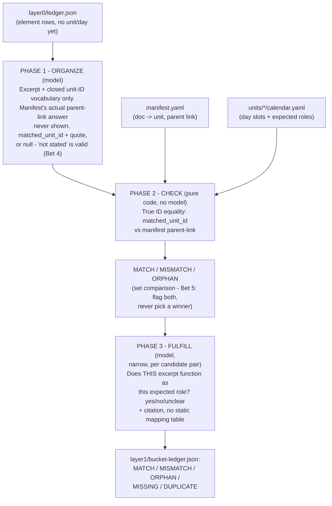

# Crystallization Pipeline — Roadmap

> **Read [BETS.md](BETS.md) first.** It captures the owner's design bets — full-document
> model reading, regex-as-hint-only, narrow repeated tasks, citations + "unknown",
> single strong model with on-demand same-model recheck, unattended resumable queue,
> conformance over calendar synthesis. Everything below serves those bets.

## Current Direction (decided 2026-07-07)

**Pivot: from calendar synthesis → placement conformance.**

The original ambition — feed in documents, get a trustworthy day-by-day
year-at-a-glance — is not realistically achievable from source docs alone.
Real curricula (e.g. Region 10) declare *milestone ranges* ("Time Frame: 10 days"),
not individual days, and lack the district calendar spine (holidays, PD, testing)
needed for honest dated pacing. Chasing full daily YAG output is a large lift for
output nobody should fully trust.

**New headline goal: conformance auditing.** Verify that the smaller pieces of a
curriculum land where they *claim* they should. Every piece has two independent
sources of truth for its position:

1. **Parent reference** — where the unit blueprint's Stage 3 section links it
   (milestone → linked doc).
2. **Self-declaration** — the piece's own header ("Unit 01 · Mile Marker: … ·
   Time Frame: 10 days").

The audit cross-references these and reports:
- **MATCH** — inferred position agrees with parent link and manifest.
- **MISMATCH** — disagreement between the two. *Flag both; do not pick a winner —
  a human decides.*
- **ORPHAN** — a file in `sources/` that no blueprint links to.
- **MISSING** — a blueprint references a milestone/doc that has no file.
- **DUPLICATE** — two docs claiming the same milestone slot.

**Core principle: model-inferred position, not header parsing.**
Documents will NOT arrive well-organized. The system must handle *any* documentation.
The models read each document — one by one — and **infer** its position and timing
from content, whether or not explicit metadata (unit numbers, mile markers, time
frames) is present. Explicit metadata, when it exists, is just one more signal the
model uses; it is never required. No regex-header dependency. This inference is the
heart of the product and must degrade gracefully on messy, unlabeled docs.

**Decisions:**
- Position/timing is **inferred by the models per document**, robust to unstructured
  input. Deterministic parsing is a fallback signal only, never the mechanism.
- Truth source on conflict: **flag both, human decides** (no automatic winner).
- Year-at-a-glance (`rollup.py`): **demoted**, not removed. Keep it but clearly
  label as a rough inferred scaffold, not real pacing. It is no longer the headline.
- Calendar's role shifts: from a *target of slots to fill* → a *set of claimed
  positions to verify* the model's per-doc inference against.
- Reuse the existing `calendar_corrections` + two-tier gap machinery in `place.py`,
  repurposed toward conformance.

## Layer 0 — Document Ingestion & Evidence Extraction (BUILT, VALIDATED on 3 corpora — 2026-07-08)

> **Status:** implemented in `layer0.py`, run end-to-end against Dallas (110 docs),
> AP CSP CED (one 266-page/419K-char stress document, chunked map-reduce path),
> and the project's actual target corpus `region10-career-college-2026` (19
> docs, single-call path). Citation fidelity — the main open risk through items
> #4-#8 below — is resolved by construction via the paragraph-range redesign
> (items #9-#10) plus the Layer 0-B split-resolver (item #11), validated on
> **both processing paths** (item #12): region10 finished at 201 elements, 0
> uncited, 4/201 (~2%) still `excerpt_wide_span` (confirmed genuine); AP CSP
> CED finished at 479 elements, 0 uncited, 45/479 (~9.4%) still `wide_span`
> (also confirmed genuine — that corpus is far more standards-table-dense).
> Remaining open items: Tier 1→Tier 2 escalation rate is still high (a tuning
> question, not a correctness one — see item #5), and `run_layer0b()` needs the
> same parse-failure retry wrapper `_decompose_text_with_retry` already has
> (see item #12).

> Full design + citations: [BETS.md](BETS.md) Bet 9 (eDiscovery/TAR grounding) and
> Bet 10 (universal element taxonomy — open research question).

**The problem, demonstrated live (2026-07-07):** re-ran `ingest.py` on the full
110-document Dallas corpus. The Analyst was asked to hold and retype ~110 exact
filenames from a 42,718-character catalog of 200-char excerpts in one shot. It
hallucinated one filename (`doc_f9710e5e4e97...` → `doc_9f9710e5e4e97...`), and
the Verifier — anchored on the Analyst's draft rather than independently
re-deriving from source — copied the same error. Ingest failed validation.
This is a breadth failure (Bet 3), not a capability failure: Gemma runs at
131K context, Qwen at 250K — both far larger than the 10.7K-token prompt that
failed. The fix is architectural, not "give it more context."

**Also demonstrated live:** a single Dallas "lesson_plan" document
(`doc_0acbc6d0b120_Engineering_Lesson_Plan.txt`) is not one atomic unit of
evidence — it contains 5 distinct 5E-model instructional elements (Engage 5-10min,
Explain 10-15min, Explore 60-120min, Extend 20-30min, Evaluate 5-10min), each
with its own timing, bundled in one file. Document-level classification alone
cannot place these correctly.

**We already made this mistake once.** Legacy `crystallize.py`
(`archive/crystallize-legacy/`) concatenated a cluster's documents into one
string and **truncated at 60,000 characters**, then ran 4 independent layers
against that same truncated blob with no shared memory between them. Layer 0
exists to prevent exactly this.

### Design

```
EXTRACT (deterministic, per file — have this: scrub_document())
  file → full text, never truncated (Bet 1)

DECOMPOSE (model, one document at a time — narrow task, Bet 3)
  full text → list of elements
  each element: { element_id, doc_id, element_type (universal function,
                  not framework-specific — Bet 10), excerpt,
                  inferred_position, inferred_timing, confidence, citation }
  regex/filename hints attached as priors only (Bet 2), never authoritative

LEDGER  ← "the table" (shared evidence base — the eDiscovery insight, Bet 9)
  one flat row per element, across ALL documents in the project.
  Every downstream layer (organize, calendar inference, placement,
  conformance) reads this ledger. None of them re-opens and
  re-interprets raw source text independently — that's what causes drift.

TIERED PROCESSING (mirrors TAR classification → relevance → privilege)
  Tier 1 — fast/cheap classification on every doc/element
  Tier 2 — deep reasoning only on what Tier 1 flags ambiguous
  Tier 3 — Analyst/Verifier cross-check (final conformance pass, Bet 5)

SORT / PLACE (place.py, repurposed toward conformance)
  read ledger rows for one unit → arrange onto calendar slots →
  cross-check against structural claims (parent links, manifest) →
  MATCH / MISMATCH / ORPHAN / MISSING / DUPLICATE findings
```

### Open questions before/during build
- Universal element taxonomy (Bet 10) — needs research, not settled.
- Ledger storage format: flat JSON per project vs. SQLite. Leaning JSON for
  transparency/auditability (matches Bet 4's citation requirement — easy to
  inspect by hand) unless scale forces a real DB.
- Where does Tier 1→Tier 2 escalation threshold live — confidence score cutoff,
  or explicit "insufficient evidence" flag from Tier 1 itself (Bet 4)?

### Definition of Done (adapted from the v1 spec's Verification Checklist)

The original v1 spec (`archive/crystallize-legacy/crystallization-pipeline-spec.md`
§11) had good instincts on this even though the pipeline shape it verified is
now legacy. Layer 0's equivalent checklist, before calling it built:

- [ ] Every source document produces ≥1 ledger row (a doc that yields zero
      elements is a bug or a genuinely empty file, not silently dropped)
- [ ] Every ledger row has a non-empty citation that verbatim-matches the
      source text (Bet 4) — no `UNCITED` rows accepted silently
- [ ] No document was truncated to produce its ledger rows (Bet 1) — chunked
      and reassembled documents are logged as such, not silently degraded
- [ ] Re-running Layer 0 on unchanged input reproduces the same ledger
      (or hits cache — Bet 6) — not fresh, divergent output each run
- [ ] A partial/failed run leaves no half-written ledger — atomic write
      (`.tmp` → rename), same discipline the v1 spec used for layer files
- [ ] The ledger contains no `FILL_ME_IN`, `TBD`, or placeholder values
- [ ] Tier escalation (Tier 1 → Tier 2) is logged per element, so it's
      auditable which elements got the cheap pass vs. the deep read

### Risk Register (adapted from the v1 spec's Risk Register, §13)

| Risk | Likelihood | Impact | Mitigation |
|---|---|---|---|
| Model returns malformed/non-schema output for an element | Medium | Bad ledger row poisons downstream layers | Validate against schema before writing to ledger; reject + retry, never write unvalidated |
| Document is too large even chunked (pathological case) | Low | Chunking still loses coherence | Log explicitly as "chunked, N parts" in the ledger — visible degradation, never silent (Bet 1) |
| Tier 1 misclassifies and never escalates to Tier 2 | Medium | Ambiguous element silently gets a shallow read | Tier 1 must be able to emit "insufficient evidence" (Bet 4) as a forced escalation trigger, not just a confidence score |
| Ledger grows large across a real district's full corpus | Medium | Every downstream layer re-scanning the whole ledger gets slow | Index/filter by project + unit before layers read it; revisit JSON vs. SQLite if this bites |
| Re-run after partial failure duplicates ledger rows | Medium | Double-counted evidence, wrong conformance findings | Content-hash cache (Bet 6) keyed per element, not per file — resuming mid-document must not re-append |
| Universal element taxonomy (Bet 10) turns out wrong for a new curriculum framework | Medium | Elements misclassified at the root, cascades everywhere | Taxonomy field is versioned; re-classification is a re-run of Layer 0 only, never requires re-touching downstream layers by hand |
| Disk full during ledger write | Low | Partial/corrupt ledger | Atomic write (.tmp → rename), same as v1 spec |

---

## Layer 1 — Sort / Bucket / Place (BUILT, VALIDATED on 1 unit + full Dallas corpus — 2026-07-08)

> **The one output all of this pays off with, stated plainly:** every layer
> in this pipeline exists to make `GLOBAL-AUDIT-REPORT.pdf` (+ its
> `DASHBOARD.md`/`aggregate-stats.json` siblings, from `synthesize.py`) more
> accurate and more defensible for a curriculum director — a report of
> MATCH/MISMATCH/ORPHAN/MISSING/DUPLICATE findings, every claim cited,
> readable in minutes instead of re-reading 19-110+ source documents by hand.
> Nothing else is the product (Bet 7). That report's findings are currently
> doc-level only (`place.py` checks "is there a file typed `worksheet` in
> this unit," not "does any actual content function as one") — Layer 1 is
> the missing join that lets Layer 0's cited, element-level evidence answer
> that same question correctly instead of coarsely.

Full research + design rationale: [BETS.md](BETS.md) Bet 11 (eDiscovery
categorization phase, distinct from Bet 9's extraction phase).

### Design: three phases, deliberately not blended



**Phase 1 — ORGANIZE (model, narrow, content-only).** Per element (or a
small per-document batch), the model sees the excerpt and the project's
closed list of valid unit IDs (vocabulary only — the same safe pattern Tier 1
already uses for the closed `element_type` list) — **never** which unit this
element's own source document was actually filed under. It fills out:

```json
{
  "element_id": "unit-2-e14",
  "self_identifies_with_a_unit": true,
  "matched_unit_id": "unit-3-financial-literacy",
  "supporting_quote": "this activity supports our unit on managing money and budgeting"
}
```

Resolving to a clean ID (not free text like `"the financial literacy
unit"`) is deliberate — it's what lets Phase 2 be true equality instead of
fuzzy string-matching (a first draft of this design got that wrong; see Bet
11's write-up of the correction). A parallel `matched_day_ref` does the same
for sequence position. Showing the model the parent-link answer here would
let it parrot the answer key back, making MISMATCH — the actual finding this
whole system exists to produce — invisible by construction.

**Phase 2 — CHECK (pure code, zero model calls).** Join `matched_unit_id`
against `manifest.yaml`'s parent-link unit for that `doc_id`:
- present and equal → **MATCH**
- present and unequal → **MISMATCH** (flag both — Bet 5, no automatic winner)
- absent (model found no self-declaration) → inherit the parent-link
  placement, tagged `basis: parent_link_only` — visibly lower-trust, never
  silently treated as equivalent to a confirmed MATCH
- `doc_id` not listed under any unit at all → **ORPHAN**

Free to re-run on its own — edit the manifest, re-run Phase 2, no model
calls needed, because Phase 1's extracted facts don't need to be re-read.
Near-duplicate/threading detection (Bet 11 practice #4) lives here too:
cheap code-level similarity (shared standards codes, near-identical excerpt
text) links two elements as `duplicate_of` before they can double-count.

**Phase 3 — FULFILL (model, narrow, per candidate pair only).** For every
day-slot with an `expected` artifact-kind role, and every element Phase 2
already routed into that slot (a handful, never the whole corpus — Bet 3
intact), ask one question per candidate: *"does this specific excerpt
function as `<expected_role>` for this lesson, regardless of what its
source document was labeled?"* — yes/no/unclear + citation, Tier 1 → Tier 2
escalation like everywhere else (Bet 9). A slot with zero `yes` results is
genuinely **MISSING**. This replaces an earlier draft that proposed a static
mapping table between Layer 0's function-based `element_type` taxonomy and
the calendar's artifact-kind `ARTIFACT_ROLES` — rejected as the wrong
trade-off on this box (Bet 0's whole point is that per-case model calls are
the cheap resource here, not the one to engineer around).

### Ledger row shape (proposed, `layer1/bucket-ledger.json`)

New artifact, not a mutation of `layer0/ledger.json` — Layer 0 stays
immutable evidence (Bet 1/9); Layer 1 writes its own file, one row per Layer
0 element plus its Phase 1-3 judgments, so Layer 0 remains independently
re-runnable.

| Field | Meaning |
|---|---|
| `element_id` | join key back to `layer0/ledger.json` |
| `matched_unit_id` / `matched_day_ref` | Phase 1's self-declared placement, or null |
| `supporting_quote` | Phase 1's own justification excerpt |
| `parent_link_unit_id` | from `manifest.yaml`, looked up in Phase 2 |
| `match_status` | `MATCH \| MISMATCH \| ORPHAN` |
| `placement_basis` | `self_declared \| parent_link_only` |
| `fulfills_role` | nullable — set only if Phase 3 ran a candidate check |
| `fulfillment_confidence`, `citation`, `tier` | mirrors Layer 0's existing fields |
| `duplicate_of` | nullable — points at another `element_id` if flagged as a near-duplicate claim |

Corpus-level findings computed after all rows are judged: **MISSING** (a
day's expected role with zero `yes` from Phase 3), **DUPLICATE** (2+
elements independently satisfying the identical unit+day+role).

### Open questions (not yet settled, tracking for the build)

- Does day/sequence placement apply to every `element_type`, or are some
  (e.g. `logistics_materials`) legitimately unit-supporting/ungrounded in
  time, not miscategorized if they never get a day match?
- Is Phase 3's role-fulfillment check the right first use of the Tier 3
  Analyst/Verifier cross-check pattern (Bet 5), given it's inherently a
  two-source-of-truth comparison, or is Gemma-Tier1/Qwen-Tier2 escalation
  sufficient here too?
- If Phase 2 routes nothing into a slot at all, does Phase 3 need a fallback
  scan of the rest of the unit's elements before calling it MISSING, or is
  "nothing routed here" sufficient grounds on its own?

### Definition of Done (mirrors Layer 0's, before calling this built)

- [ ] Phase 1 never sees a manifest parent-link answer before producing its
      own independent placement guess
- [ ] Phase 2 makes zero model calls — pure ID equality, verifiable by
      reading the code, not by trusting a description of it
- [ ] Every MISMATCH/ORPHAN/MISSING finding carries a citation back to
      Layer 0's already-verbatim excerpt (no new citation risk introduced)
- [ ] Validated by hand on one small, already-understood unit
      (`unit-1-fundamentals-leadership`, 4 docs) before any full-corpus run
- [ ] `layer0/ledger.json` is never mutated by Layer 1 — `bucket-ledger.json`
      is a separate, joinable artifact

### Build + validation status — BUILT, VALIDATED on 1 unit (2026-07-08)

`layer1.py` built (all three phases) and run against
`region10-career-college-2026`'s `unit-1-fundamentals-leadership` (4 source
documents, 41 Layer 0 elements) via `--only-unit`. Every MATCH/MISMATCH/
ORPHAN/MISSING/FULFILLED/DUPLICATE call was hand-checked against the actual
excerpt text, same rigor as Layer 0's single-document validation. Three real
bugs found and fixed from that hand-check, none hypothetical:

1. **Day-vocabulary prompt bug — model copied the display format, not the
   value.** The closed day list was shown as `"unit_id / day_id: label"`
   flat lines; the model consistently returned the WHOLE combined string
   (`"unit-1-fundamentals-leadership / d1"`) as `matched_day_id` instead of
   the bare `"d1"`. Because Phase 2 joins by exact string equality, this
   silently broke EVERY day match on the first run — all 41 elements landed
   with `final_day_id: null`, and Phase 3 reported 15/15 slots as MISSING
   purely from this formatting bug, not a real gap. Confirmed by a hand-check
   of an element whose own text plainly states `"Mile Marker: Describe and
   explain the different types of leadership"` (this unit's own `d1` label)
   yet was routed nowhere. **Fix:** restructured the day vocabulary to be
   grouped by unit heading with an explicit `day_id=<value>:` prefix per
   line, tightened the prompt rule to say "ONLY the value after `day_id=`,
   never the unit_id heading, never the label text," and added
   `validate_judgment()` — a defensive guard (same discipline as Layer 0's
   `resolve_excerpt()` bounds-check) that nulls out any `matched_unit_id` or
   `matched_day_id` the model returns that isn't literally in the closed
   vocabulary it was given, logging a warning instead of silently trusting a
   malformed pick. Re-run after the fix: 0 validation warnings, 9/41
   elements correctly self-declared a real `d1`-`d4` day.
2. **`unit_supporting` routing excluded 66% of the unit's evidence.** Initial
   Phase 3 routing only sent an element to a slot when `final_day_id`
   matched that slot's id exactly — correct for `d1`-`d4`, but wrong for
   `unit_supporting`, which `calendar.yaml` deliberately keeps separate from
   the day list precisely because it is NOT day-specific. That routing rule
   meant only elements with an explicit self-declared day (a small minority
   — most body content never restates its own unit/day) were ever eligible
   candidates for `unit_supporting`, while the 26-27 `UNVERIFIED`
   (parent-link-only) elements — which still legitimately belong to this
   unit — were silently excluded from the one slot that doesn't need day
   precision to be a fair candidate. **Fix:** widened `unit_supporting`'s
   candidate pool to every element whose `final_unit_id` matches, with
   `final_day_id` either null or `unit_supporting` — day-specific slots
   (`d1`-`d4`) still require an exact self-declared match, unchanged. Result
   after the fix: `unit_supporting` went from 0 candidates on every role to
   real candidates, surfacing a genuine `lesson_plan`-role FULFILLED finding
   (see below) that the bug had been hiding entirely.
3. **DUPLICATE status logic conflated "multiple legitimate sources" with
   "same claim counted twice."** The first version flagged any role with
   2+ fulfilling elements as DUPLICATE. Hand-checking the resulting
   `unit_supporting: lesson_plan` DUPLICATE finding (3 fulfilling elements)
   against their actual excerpts showed all three were genuinely distinct
   day-by-day sequences from three different planning-guide documents (one
   per milestone) — not a restatement of the same claim at all (confirmed:
   `duplicate_of: null` on all three via the near-dup check already built
   for exactly this purpose). Multiple independent, non-duplicate sources
   satisfying one role is a good finding, not a problem to flag — this is
   the opposite of what Bet 11's near-dup research practice #4 was meant to
   catch. **Fix:** added `is_true_duplicate()` — DUPLICATE now only fires
   when 2+ of a role's fulfilling elements are themselves linked via
   `duplicate_of`; otherwise a role satisfied by any number of genuinely
   distinct elements is FULFILLED. Re-run: the same 3-element case now
   correctly reports FULFILLED.

**Final validated result on `unit-1-fundamentals-leadership`:** 41 elements
judged, 15 MATCH (self-declared and agrees with manifest), 0 MISMATCH, 0
ORPHAN, 26 UNVERIFIED (parent-link only, no self-declaration in the text —
confirmed by hand-check to be an honest "not stated," e.g. a bare `"Time
Frame: 10 days"` line has no unit/day reference to find). 15 role findings:
2 FULFILLED (a "Cornerstone Task" infographic assignment correctly judged to
function as `d4`'s `worksheet` role despite being Layer 0-typed
`assessment_checkpoint` — Phase 3's whole reason for existing, judging
function over label, working as designed; the 3-source `lesson_plan`
fulfillment above), 13 MISSING. The 13 MISSING findings (no `lesson_content`
across any of the 4 milestones, no `presentation` anywhere, no `rubric` or
`project_work` artifact despite being described in task instructions) agree
directionally with the older doc-level `place.py` audit's existing finding
that this unit already had calendar gaps — a useful cross-check that the new
element-level mechanism isn't inventing problems the coarser one didn't
already suspect, while being far more specific about exactly which role is
missing and why (with a citation-backed reason, not just "no file found").

**Known limitation, not yet fixed:** day-specific slots (`d1`-`d4`) can only
ever route an element as a candidate if Phase 1 found an explicit
self-declaration of that exact day in the element's own text. For a corpus
where most content doesn't restate its own day (this unit: 26/41 elements),
day-level MISSING findings are likely over-reported relative to
`unit_supporting`'s findings — a `lesson_content` element that genuinely
belongs to `d2` but never says so in its own words will show as `d2:
lesson_content MISSING` even if it exists somewhere in the unit, un-routed.
This is the first open question from the design doc (does day placement
make sense for every element) showing up as a real, not hypothetical,
result — worth watching once this runs against units with less self-
referential planning-guide text.

Not yet run: MISMATCH/ORPHAN cases (this unit had none to validate against —
every document here genuinely belongs to its own unit, so a next validation
pass should specifically pick a unit or add a deliberately mismatched
document to confirm those code paths fire correctly before trusting them on
a full corpus), and any unit beyond this one. Full-corpus run stays out of
scope until that follow-up.

### Full-corpus run + MISMATCH signal refinement (Dallas, 112 docs, 2026-07-08)

First full-corpus `layer1.py` run (the whole DISD 8th-grade course, not just
one unit) produced 895 judged elements and 143 raw MISMATCH rows. Hand-
checking a sample (prompted directly by the user recognizing some of these
looked like real template-misuse errors from people they know built this
curriculum, not pipeline bugs) confirmed MISMATCH is a real, valuable finding
— but also surfaced two unrelated sources of noise needing two separate
fixes, both written up in full in [BETS.md](BETS.md) Bet 12:

1. **Hub/overview units need a class-aware equality rule.** 73 rows were
   "Career Cluster"/"Career Exploration"/"Dallas ISD" hub documents correctly
   cross-referencing other units (not a misfile), plus 14 boilerplate-branding
   rows and 12 standards-citation false triggers. Fixed with a `kind: overview`
   manifest tag, hub-aware `check_placement()` rules, and a `PHASE1_RULES`
   addition distinguishing a document's own content ("aboutness") from a
   standards code merely mentioning a term ("mention").
2. **Human-in-the-loop calibration for the remaining ambiguous cases.** Even
   after fix 1, two equally-corroborated MISMATCH findings could mean opposite
   things: a genuine misfile (Carrasco_Brainstorm.txt, two swapped project
   rubrics) vs. expected cross-discipline overlap (an Architecture &
   Construction lesson's paper-tower activity self-declaring "engineering" —
   on-topic per Texas CTE's own TEKS). No code-only signal can tell these
   apart; added a human-curated `known_overlaps` list to `manifest.yaml`
   (same pattern as `kind: overview`), a new `EXPECTED_OVERLAP` status in
   `check_placement()`, and an always-generated `layer1/REVIEW-QUEUE.md`
   grouping every remaining MISMATCH by unit-pair with sample excerpts for a
   human reviewer to decide, once per pair (not once per document).

**Full re-run results after both fixes**, same 112-document Dallas corpus:

| | Before fix 1 | After fix 1 | After fix 2 (known_overlaps populated) |
|---|---|---|---|
| MATCH | — | — | 195 |
| MISMATCH | 143 (raw) | 22 (18 high-conf, 4 low-conf) | 12 (10 high-conf, 2 low-conf) |
| CROSS_REFERENCE | 0 | 62 | 63 |
| EXPECTED_OVERLAP | (status didn't exist) | (status didn't exist) | 10 |
| ORPHAN | — | — | 0 |
| UNVERIFIED | — | — | 615 |

Validated by hand: the two confirmed pairs (`[architecture-construction,
engineering]`, `[transportation-distribution, engineering]`) reclassified
exactly the 10 elements they should (8 from the paper-tower document, 2 from
the Lego-airplane document) to `EXPECTED_OVERLAP`, while
Carrasco_Brainstorm.txt (10/10 corroborated) and the two swapped rubrics
(1/1 each, `information-technology`↔`business-marketing` and
`business-marketing`↔`health-science` — their own header text literally names
the other cluster) remained MISMATCH, unchanged — confirming the mechanism
resolves ambiguity without hiding real errors. Phase 2 re-check required zero
model calls, as designed.

**Known gap, not yet hit in practice:** `layer1-organize-ff5244c8fa47` (a
120-element document, the corpus's largest) failed all retries with a 300s
read timeout on this run and was left unjudged (logged, not silently
dropped — `run_layer1`'s per-document try/except, same discipline as Layer
0's per-chunk isolation). Every other document succeeded. Worth revisiting if
large documents keep landing in this corpus: either a per-document size
threshold that splits Phase 1's prompt (mirroring Layer 0's chunking), or a
longer timeout specifically for large-batch Phase 1 calls.

### `synthesize.py` re-sourced onto Layer 1 (2026-07-08)

The gap this closes: `synthesize.py`/`render_pdf.py` still built
`GLOBAL-AUDIT.md`/`DASHBOARD.md` from `place.py`'s doc-level `02-gap-report.json`
even after Layer 0/1 existed — nothing downstream ever read Layer 1's richer,
cited, element-level findings. A curriculum director had no artifact of their
own to read; only an agent manually inspecting `bucket-ledger.json`/`findings.json`
could explain what the pipeline found.

Rewrote [`synthesize.py`](../synthesize.py)'s data loading, aggregation, and
rendering to read `layer1/bucket-ledger.json` + `layer1/findings.json` instead
(raises a clear error telling the operator to run `layer1.py` first if that
project has no Layer 1 output yet — no silent mixing of the two data models).
`GLOBAL-AUDIT.md` now embeds a plain-language glossary of every status
(MATCH/MISMATCH/CROSS_REFERENCE/EXPECTED_OVERLAP/ORPHAN/UNVERIFIED/MISSING/
DUPLICATE/FULFILLED) directly in the report, an executive summary, a
"needs your attention" section (high/low-confidence MISMATCH with citations +
a pointer to `layer1/REVIEW-QUEUE.md`'s pending count), systemic gaps (a role
missing in 3+ *units*, not just 3+ findings), and a per-unit drill-down. The
optional `--model` flag still only rewrites the executive-summary prose — the
glossary, citations, and tables are always code-rendered, never model-touched
(Bet 5: auditor-only, no invented content). Validated against the Dallas run:
executive summary, high/low-confidence MISMATCH list, and systemic gaps all
matched the hand-checked findings from the human-in-the-loop validation above.

One real bug found and fixed during validation: the first version of
`DASHBOARD.md`'s unit-heatmap coloring used `missing >= 4` as its red
threshold — but MISSING findings are pervasive across this corpus (every
single unit has 3+, a real finding on its own, see "systemic gaps"), so that
threshold made 17/18 units red, drowning out the one signal a heatmap should
actually highlight. Fixed: red is reserved for MISMATCH (a genuine
self-declared conflict — the rarer, stronger signal), yellow flags DUPLICATE,
green is neither — regardless of MISSING count. Re-validated: 3 red
(matching the 3 units with real MISMATCH findings), 2 yellow, 13 green.

`render_pdf.py` now uses WeasyPrint + an HTML/CSS Crystallize print theme
(`assets/pdf/`, `pdf_theme/`) for the four live packet PDFs; markdown
pipe-tables render as real HTML tables. Archived per-unit `AUDIT-REPORT.pdf`
calendar grids still use ReportLab until a later pass.

**Scope explicitly deferred, not done in this pass:** wiring `layer0.py`/
`layer1.py` into `run_project.py`'s automatic orchestration (both still run
manually); a real table-rendering pass for the PDF; migrating the per-unit
calendar-coverage grid (`AUDIT-REPORT.pdf` per unit, and the heatmap section
inside `GLOBAL-AUDIT-REPORT.pdf`) off `place.py` — that's a different data
shape (day-by-day coverage) Layer 1 doesn't produce yet.

---

## Documentation + universality audit (2026-07-08)

End-of-session check: is the documentation still accurate, and does the
pipeline actually run identically for any project id, or has curriculum-
specific behavior crept into "universal" code paths? Two real, distinct
problems found and fixed.

**1. Regression: `run_project.py` would now hard-fail for every project
except `dallas-career-2026`.** Since the `synthesize.py` rewrite (previous
section) made it require `layer1/bucket-ledger.json`, and Layer 0/1 are
deliberately not wired into `run_project.py` yet, the very last step of the
one-command pipeline would raise on any project without Layer 1 output on
disk — which tonight is every project except the one manually run today.
`run_project.py --project ap-csp-2026` (or any fresh project) would report
overall failure even though ingest/rollup/place.py's per-unit PDFs all
succeeded. Fixed: the synthesize step is now wrapped so a missing-Layer-1
failure degrades to a `WARN` with the exact commands to fix it, instead of
failing the whole run — the legacy doc-level outputs are still a complete
result on their own. Verified by calling `synthesize.py` directly against
`ap-csp-2026` (no `layer1/` dir) and confirming a clean exit code 1 + message,
not a traceback.

**2. Real Dallas-only special-casing found in `run_project.py`** (the one
script explicitly meant to "run the same way for every project"):
- `--setup` flag called `BASE_DIR / "setup_project.py"` — a file that no
  longer exists at the repo root (only the archived copy under
  `archive/crystallize-legacy/` does). This flag was silently broken for
  everyone, dallas included. Removed, along with the now-dead
  `SETUP` constant and an unreachable `elif not manifest.is_file(): return 2`
  branch (unreachable because the preceding `if` already catches that case).
- The no-sources fallback branch special-cased
  `if legacy.is_dir() and args.project == "dallas-career-2026"` to read from
  `data/career-curriculum/osint/` instead of `projects/<id>/sources/`. That
  external directory is a documented backup of the same 111 files already
  in `projects/dallas-career-2026/sources/` (confirmed identical via `diff`),
  so the special case was redundant even for Dallas, and every other project
  would have hit a generic "no sources" error while Dallas alone got a silent
  fallback. Removed — every project now hits the same error message if
  `sources/` is empty and `--sources` isn't passed, no exceptions.

**Folder-structure check:** every project under `projects/<id>/` now follows
the same `{sources, units, manifest.yaml, layer0/, layer1/, output/}` shape
uniformly — confirmed across `dallas-career-2026`, `ap-csp-2026`,
`region10-career-college-2026`, `openscied-6` (some don't have `layer0/`/
`layer1/` yet simply because those steps haven't been run for them, not
because the shape differs). `runs/` (operator logs) and `reference/`
(supplementary source scans) are legitimate per-project folders written by
`inbox-watch.py`/manual curation respectively, not Dallas-specific — they
just haven't been populated for every project yet.

One leftover found and removed after owner confirmation:
`projects/dallas-career-2026/_backup-manifest-20260707/` — a manual,
one-off snapshot of `manifest.yaml`/`school-calendar.yaml`/`units/` from
before today's `kind: overview`/`known_overlaps` additions. Not referenced by
any code, and no other project had an equivalent. Deleted (git history covers
it if it's ever needed again).

**Documentation staleness fixed:** `README.md`, `REPO-MAP.md`, `OPERATORS.md`,
`docs/PRODUCT-OVERVIEW.md`, `docs/PIPELINE.md`, `docs/ARCHITECTURE.md`,
`docs/DATA-FLOW.md`, `docs/FILE-FLOW.md` had zero mentions of Layer 0/Layer 1
anywhere — despite Layer 0/1 being, per Bet 7, the actual product now. Someone
reading only those files (the ones actually meant to orient a new reader)
would never learn Layer 0/1 exists. `docs/PRODUCT-OVERVIEW.md` (the
director/partner-facing doc) was the worst case: its capability table still
listed "Placement conformance auditing | Planned (headline goal)" after it had
already been built and validated on a full corpus. Fixed with accurate status
tables (`PRODUCT-OVERVIEW.md`) or brief top-of-file callouts pointing to this
roadmap (`PIPELINE.md`, `ARCHITECTURE.md`, `DATA-FLOW.md`, `FILE-FLOW.md` —
their Mermaid diagrams still describe the legacy path and were not redrawn;
that's a separate follow-up, not done tonight).

---

## Completed

- [x] **Remove document truncation** — `build_evidence_block()` in `place.py` no longer slices `content_clean` at 8000 chars. All evidence text is sent to models in full.
- [x] **AP CSP CED stress test** — 266-page framework document, 5 units. Pipeline correctly identified it as a framework, flagged no lesson plans/exit tickets as expected.
- [x] **Dallas ISD Career Cluster stress test** — 18 units, 111 documents (lesson plans, slides, rubrics, exit tickets, quizzes, worksheets, answer keys). Pipeline completed exit code 0. Found real gaps (missing exit tickets, unplaced docs) + revealed structural issues below.
- [x] **Layer 0 built and stress-tested end-to-end (2026-07-07)** — `layer0.py` implements
  the full EXTRACT → DECOMPOSE (Tier 1 Gemma / Tier 2 Qwen) → LEDGER design from Bet 9/10.
  Validated first on the single engineering lesson plan (correctly found all 5 5E phases
  plus standards/logistics elements — the exact case that motivated Bet 9), then run
  against the **full 110-document Dallas corpus, one document at a time, unattended**:

  | Metric | Result |
  |---|---|
  | Documents scanned / extracted OK | 111 / 110 (1 file had no extractable text) |
  | Elements in ledger | 1,135 |
  | Tier 2 escalations | 100 of 108 successfully-decomposed docs (~93%) |
  | Documents fully failed (0 elements) | 2 (both transient — see below) |
  | Uncited excerpts (flagged, not silently dropped) | 206 of 1,135 (~18%) |

  **This is the concrete proof the original per-document approach was right**: no
  hallucinated filenames, no cross-document drift — the exact failure mode that broke
  `ingest.py` on this same corpus (see "The problem, demonstrated live" above) cannot
  happen here by construction, because each model call only ever sees one document.

  **Real bugs found and fixed during this run** (kept here so they aren't silently
  re-introduced):
  1. **Citation whitespace-normalization bug** — source docs wrap mid-sentence; a
     verbatim quote joined with spaces by the model was being flagged UNCITED purely
     because of a newline it never treated as meaningful. Fixed with a shared
     `normalize_ws()`/`excerpt_cited_in()` helper in `audit_lib.py`, applied to both
     `layer0.py` and `place.py` (this was also the pre-existing, previously-unsolved
     "UNCITED placement flag" issue below, #5 — now fixed in both places at once).
  2. **No retry on parse failure** — a 200 OK response that comes back truncated or
     malformed mid-generation (observed live) was treated as fatal after only one try.
     `model_chat()` already retried HTTP/connection failures; parse failures needed
     their own retry. Fixed: one retry on JSON-parse failure before giving up on a
     document.
  3. **Ledger only written once, at the very end** — a crash or interruption mid-run
     would have silently lost every already-completed document's work, violating
     Bet 6 (resumable, unattended). Fixed: the ledger is now checkpointed
     (atomic-written) after every single document.
  4. **~45% of "uncited" flags traced to one root cause**: the model appending a
     literal `"..."` to the end of an excerpt instead of quoting a complete, exact
     span — not a citation-matching bug, a genuine prompt-compliance gap. Fixed by
     explicitly forbidding ellipsis-truncated excerpts in the Tier 1/2 prompts. The
     remaining ~55% (113 elements) are genuine minor citation-fidelity catches (e.g.
     the model skipping one clause while assembling a quote across a list/caption
     break) — the citation check doing exactly what Bet 4 asks of it, not a bug.
  5. **Tier 1→Tier 2 escalation is currently near-universal (~93%)**, not the
     "expensive only when ambiguous" split the design intends. Tier 1's confidence
     calibration needs tuning — right now it isn't actually saving the compute the
     tiering was meant to save. Open follow-up, not yet fixed.

## Structural Issues Found

### 1. Calendar-first vs curriculum-first (HIGH PRIORITY)

**Problem:** The pipeline creates calendars during `ingest.py`, then `place.py` treats them as ground truth. Models must fit documents into existing day slots. If the calendar says "2 days" but the curriculum is a 6-day project with presentations, 20 documents go "unplaced" and the gap report is misleading.

**Fix needed:** Shift to curriculum-first flow. The placement phase should give models the authority to:
- Propose calendar expansions when documents clearly span more days
- Flag project blocks, student work days, presentation days as valid pedagogical phases — not gaps
- Distinguish between "curriculum genuinely missing an exit ticket" vs "calendar didn't have enough slots"

**Changes:**
- `place.py`: Gap report should have two tiers — (A) calendar-phasing mismatches and (B) actual content gaps
- `ingest.py`: Calendar creation should be provisional, with placement empowered to correct it
- `run_project.py`: Order of operations becomes ingest → scrub → place (with calendar flexibility) → reconcile calendar → audit → rollup

### 2. Project/presentation day detection (HIGH PRIORITY)

**Problem:** The document type classifier (`classify_doc_type()`) only recognizes: `lesson_plan`, `lesson_content`, `exit_ticket`, `quiz`, `answer_key`, `rubric`, `worksheet`, `other`. There's no concept of `project_day`, `presentation_day`, `game_day`, `lab_day`, `flex_day`.

Curriculum designers routinely use:
- "Day 3: Work on commercial project" (no exit ticket needed)
- "Day 4: Present 3-course meal menu" (no lesson content needed)
- "Day 5: Career Cluster Bingo" (review game, not a typical lesson)

**Fix needed:** Extend the role vocabulary to include pedagogical phase types. The model should classify documents by their actual classroom use, not just file naming conventions.

**Changes:**
- `audit_lib.py` `classify_doc_type()` — add: `project_work`, `presentation`, `game`, `lab_activity`, `flex_day`, `student_notes`
- `place.py` gap detection — don't flag missing `lesson_content` on presentation days
- Calendar expectations (`expected:` in calendar.yaml) should include these as valid roles

### 3. Flex days as first-class calendar slots (MEDIUM PRIORITY)

**Problem:** Real curriculum pacing guides include 1-2 flex days per grading period ("teacher choice — reteach or enrich"). The pipeline currently has no concept of these, so they show up as gaps.

**Fix needed:** Calendar schema should accept `flex_day` as a valid day type. Placement should not flag it as missing anything. Rollup/year-map should honor flex days in pacing calculations.

**Changes:**
- Calendar schema: `day_type: instructional | flex | assessment`
- Gap report: exclude flex days from expected-artifact checks
- Rollup: flex days still consume a calendar day but don't require content

### 4. Large single-document chunking — TESTED, GAP CONFIRMED (2026-07-07, via Layer 0)

**Now has real test data.** Ran `layer0.py` against `ap-csp-2026` — a single 266-page,
843,193-character PDF (the AP CSP Course & Exam Description). Result: **no crash, no
context-overflow error — but only 13 elements extracted from the entire document.**
That is severe under-coverage for 266 pages covering 5 Big Ideas, computational
thinking practices, exam specs, and sample instructional activities.

**Root cause, confirmed from the model's own notes:** `build_document_block()`'s
"chunking" only reassembles oversized text into one string with `--- PART N of M ---`
markers and still sends it as **one single prompt**. This is NOT the map/reduce Bet 1
actually specifies ("split into overlapping, heading-aware chunks... a second pass
merges the per-chunk observations"). At 843K chars (~200K+ tokens), the model
correctly recognized the document as a framework rather than a lesson plan and
responded reasonably to the *question it was asked* — but gave a small
**representative sample** of elements per category rather than exhaustively citing
every distinct standard/claim/activity. The ledger ended up with ~13 rows standing
in for content that should plausibly be hundreds of rows. This is a genuine violation
of Bet 9 (the ledger must be a *complete* shared evidence base, not a sample of one).

Secondary, unconfirmed observation: AP CSP CED is a widely-published, publicly
available document almost certainly present in both models' pretraining data. 9 of
13 excerpts (69%) failed citation verification — a much higher rate than Dallas's
overall 18% — consistent with (but not proof of) the model drawing on memorized
knowledge of AP CSP's structure rather than purely reading the 843K characters given
in the prompt. Worth keeping in mind for any future evaluation using well-known
public curricula: citation-checking matters *more*, not less, on documents a model
may have memorized.

**Fix built and validated (same day):** real map-reduce chunking — `split_into_chunks()`
splits oversized documents into paragraph-boundary chunks (~60K chars, 2-paragraph
overlap so a boundary-spanning element still appears whole in one chunk), one
Tier 1/Tier 2 call **per chunk**, then a reduce/dedup merge. Result on the same
document: **13 elements → 488 elements** (15 chunks, 14 escalated to Tier 2). Two
more real bugs surfaced and fixed building this:
- `parse_model_json()` used strict JSON parsing, which rejects a literal unescaped
  control character inside a quoted string — a rare but genuine, **deterministic**
  model output pattern (retrying did nothing, the low-temperature model reproduced
  the exact same "bad" character every time). Fixed: `json.loads(..., strict=False)`.
- A single chunk's failure was aborting the **entire document**, discarding every
  other already-succeeded chunk — the same Bet 6 mistake as before, recurring one
  layer down. Fixed: each chunk's Tier1→Tier2 call is now wrapped individually;
  a failed chunk is skipped and logged, the rest of the document still completes.

**New confirmed finding (was previously a "secondary, unconfirmed observation" —
now has direct evidence): the model is reciting memorized training data, not
purely reading the provided PDF extraction, for a document this widely published.**
`doc_extract.py`'s PDF text extraction produces visibly garbled output for this
particular multi-column PDF (e.g. the actual extracted opening reads
`"...\x07 reate performance\nC\ntask guidelines..."` — literal control characters,
words split mid-letter from column-interleaving). Yet the model's excerpts read as
clean, grammatically perfect, textbook-correct AP CSP prose that **does not appear
anywhere in the actual extracted text, even after whitespace normalization** — e.g.
it quoted "AP Computer Science Principles introduces students to the breadth of the
field of computer science..." as if reading it verbatim, when the real extracted
text at that point is unreadable column-scrambled fragments. This pattern holds
throughout the document, not just the garbled cover page (27%-100% uncited per
chunk, all 15 chunks affected). **This means citation-checking is doing exactly its
job here** — correctly refusing to accept confident-sounding claims that aren't
actually grounded in the evidence given — but it also means two distinct root
causes are tangled together in this one test and need separate fixes:
1. **PDF extraction quality** for complex multi-column layouts (a `doc_extract.py`
   problem, separate from Layer 0) — feeding a model garbled text and expecting
   faithful citation is unfair to the model.
2. **Memorization risk on well-known public curricula** — any future evaluation
   against widely-published documents (like this one) needs citation-checking
   treated as load-bearing, not optional, since the model's fluency can mask
   ungrounded recall. Custom/unpublished curricula (like Dallas) don't have this
   confound, which is likely part of why Dallas's uncited rate (18%) was so much
   lower than this document's (80%).

**Also found and fixed (same day):** several Tier 1/Tier 2 chunk calls failed with
`Expecting ',' delimiter` JSON errors, consistently around 27K-36K characters into
the response — i.e. right at the `max_tokens=8192` response ceiling. Content-dense
chunks (many standards, many elements) can produce responses long enough to get
cut off mid-generation, which is a deterministic failure retries can't fix. Fixed:
`max_tokens` raised from 8192 to 16384 for decompose calls in `layer0.py`.

### 5. UNCITED placement flag — RESOLVED (2026-07-07, via Layer 0 build)

**Problem (was):** Many placements are flagged `⚠ UNCITED` — the model claimed an excerpt but `excerpt_in_evidence()` can't match it back to the source text. This is partly a normalization issue (whitespace, punctuation) and partly the model paraphrasing instead of quoting.

**Root cause found:** confirmed to be whitespace normalization — source docs wrap
mid-sentence, and a correct verbatim quote gets joined with spaces by the model,
which then fails a naive substring check purely because of a newline. Found and
fixed while stress-testing Layer 0 against the full Dallas corpus (see Layer 0
entry under Completed, above).

**Fix applied:** `normalize_ws()` + `excerpt_cited_in()` in `audit_lib.py` — collapses
whitespace runs before comparing. Applied to both `place.py`'s `excerpt_in_evidence()`
and `layer0.py`. Remaining uncited flags after this fix are genuine citation-fidelity
catches (model paraphrasing/dropping a clause, or appending "..." instead of a
complete quote — the latter now also blocked at the prompt level in `layer0.py`),
not false positives.

### 6. Chunking strategy — RESEARCHED, ONE UPGRADE SHIPPED (NEGATIVE RESULT) (2026-07-07)

After the AP CSP CED stress test (#4 above) surfaced both under-extraction and
apparent memorization, the natural next question was: is our chunking approach
(heading/paragraph-aware, ~60K-char chunks, 2-paragraph overlap, dedup on reduce)
actually good, or did we just build the first thing that worked? Went and checked
current (2026) academic/industry literature on document chunking rather than
guess. Full reasoning and citations now live in `docs/BETS.md` (Bet 1, "Is
heading/paragraph-aware chunking actually the right method" subsection) since
that's where the design bet itself lives — summary here for the roadmap trail:

- **Validated, not changed:** structure-based (paragraph/heading) chunking is the
  literature-backed default over semantic (embedding-boundary) chunking, which
  needs threshold tuning most teams don't do well and fragments badly when they
  don't (arXiv 2602.16974; Vecta 7-strategy benchmark, Feb 2026). No change made.
- **Shipped:** `build_doc_orientation()` in `layer0.py` — every chunk of an
  oversized document now gets the document's own opening ~600 characters
  prepended verbatim (zero extra model calls). This is our adaptation of
  Anthropic's "Contextual Retrieval" chunk-context-prefix technique, adjusted
  because the direct technique (LLM-generated per-chunk context) is evidenced to
  *hurt* in-document tasks like ours, not just cost more — see BETS.md for the
  full citation trail. Goal: give the model enough orientation that it stops
  falling back on memorized priors when a chunk alone doesn't say what document
  it's in (the failure mode from the AP CSP CED run). **Re-validated same day —
  result: no meaningful improvement.** Re-ran `layer0.py --no-resume` on the same
  `ap-csp-ced.pdf` (also picking up the `max_tokens=16384` fix from item #4,
  which had not yet landed when the 488/390 numbers were measured). New run: 823
  elements, 634 uncited (77.0%). Looks like progress, but almost all of the +335
  elements came from `chunk14of15` alone (116 elements) — the chunk that
  previously failed outright on the `max_tokens` ceiling and was skipped
  entirely, now recovered by that unrelated fix. **Excluding chunk14, the
  like-for-like uncited rate is 79.1% — statistically indistinguishable from the
  pre-orientation 79.9%.** The orientation prefix did not move the needle.
  Spot-checked the uncited excerpts directly: they're still clean,
  textbook-perfect AP CSP prose (e.g. "AP Computer Science Principles introduces
  students to the breadth of the field of computer science...") on
  `chunk1of15`, which doesn't even receive the orientation prefix (skipped for
  the first chunk since it's redundant with the chunk's own content) — direct
  proof the memorization is not an orientation/context-window problem at all.
  **Conclusion: kept the orientation prefix (zero-cost, theoretically sound,
  harmless) but it is not the fix for this failure mode.** The root cause is
  exactly what was already flagged in item #4: garbled multi-column PDF
  extraction forcing the model to choose between quoting nonsense or reciting
  the clean version it memorized, and it's choosing memory. The real fix lives
  in `doc_extract.py`'s PDF text extraction, not in Layer 0's chunking
  strategy — this result closes the loop on "should we tune chunking further to
  fix memorization" with a clear no.
- **Logged, not built:** LLM-guided boundary detection (LumberChunker-style — use
  Gemma to find topic-shift breakpoints instead of accumulating paragraphs to a
  size limit) is the one method literature shows *beating* structure-based
  chunking specifically for in-document tasks. Costs one extra Gemma pass per
  oversized document. Worth reaching for if boundary-splitting an element in half
  ever shows up as an actual observed failure (it hasn't yet — overlap + dedup
  seem to be covering it) — not worth the added latency pre-emptively.
- **Deliberately not changed:** overlap. Some 2026 work finds overlap gives no
  measurable *retrieval* benefit (arXiv 2601.14123), but our overlap exists to
  stop an element from being split in half at a chunk seam, not to help a query
  match nearby text — a different problem that literature aimed at RAG retrieval
  doesn't test either way.
- **Caveat that applies to all of the above:** virtually all published chunking
  research targets RAG retrieval (find the one relevant chunk for a query out of
  a corpus). Layer 0 does the opposite — exhaustive extraction from one document,
  no query. Treat every finding above as directional, and treat our own
  citation/coverage numbers on real curriculum runs as the actual scoreboard.

### 7. PDF extraction quality for multi-column layouts — FIXED AND VALIDATED (2026-07-07)

Both the chunking-strategy investigation (#6) and the original AP CSP CED run (#4)
pointed at the same underlying cause from two different angles: `doc_extract.py`'s
PDF text extraction visibly mangled multi-column layouts (literal control
characters, words split mid-letter from column-interleaving — see #4 for the raw
example). Two rounds of Layer 0 tuning (map-reduce chunking, then document
orientation) each measurably fixed something real, but neither touched the
~79-80% uncited rate on this document, because the actual chunk text handed to
the model was too garbled to quote from — the model reached for its training-data
memory of AP CSP instead, and citation-checking (correctly) rejected the result.

**Root cause found and fixed same day.** `doc_extract.py`'s `_extract_pdf()` was
calling `pdftotext -layout`. `-layout` tells poppler to preserve each line of text
at its literal physical X position on the page — which is exactly backwards for a
multi-column layout: it stitches together whatever text sits at the same Y
position *regardless of which column it came from*, interleaving unrelated
columns word-by-word (confirmed example: a sidebar definition column merged
mid-sentence into the main column, "Learning objectives definewhatastudent
shouldbeableto do..." — spaces even dropped). Removing `-layout` (poppler's
default mode uses genuine reading-order reconstruction instead of raw physical
position) fixed this immediately, confirmed on two independent PDFs (AP CSP CED,
and an OpenSciEd teacher's-edition PDF's three-column credits page), with no
regression on single-column tables/TOCs tested side by side. See the comment on
`_extract_pdf()` in `doc_extract.py` for the full before/after evidence.

**Re-ran Layer 0 on the same `ap-csp-ced.pdf` with only this one-line fix
changed, everything else identical:**

| Run | Extraction | Elements | Uncited | Uncited rate |
|---|---|---|---|---|
| Baseline (map-reduce, pre-`max_tokens` fix) | `-layout` (garbled) | 488 | 390 | 79.9% |
| + orientation prefix (#6, negative result) | `-layout` (garbled) | 823 | 634 | 77.0%* |
| **+ PDF extraction fix (this item)** | **default (clean)** | **561** | **382** | **68.1%** |

\* ~79.1% like-for-like once the one chunk recovered by the unrelated `max_tokens`
fix is excluded — see #6.

An 11-point drop in uncited rate from a one-line change, versus a rounding error
from the orientation prefix — this is strong confirmation that extraction quality,
not chunking or prompt context, was the dominant lever. Extracted document length
also dropped from 843K to 419K characters (all the rest was dead whitespace
`-layout` was padding in to fake column alignment), which halved the chunk count
(15 → 7) and roughly halved wall-clock run time as a free side effect.

**The remaining 68.1% uncited rate is not a new problem — it's the memorization
problem from #4, now cleanly isolated from the extraction-garbling problem.**
Spot-checked several post-fix uncited excerpts directly against the clean
extracted text (e.g. "The AP Computer Science Principles course surveys topics
across several knowledge areas recommended by the Association for Computing
Machinery...") — confirmed **absent from the document entirely**, not a
formatting near-miss. This is the model reciting genuinely memorized AP CSP
boilerplate, not paraphrasing something it read. Expected to be far less
prevalent on non-famous, custom curricula (Dallas's uncited rate was 18% with no
training-data-overlap confound) — AP CSP CED is closer to a worst-case stress
test for memorization than a representative document. No further action planned
here; citation-checking is working as designed by rejecting these.

### 8. Mid-excerpt ellipsis splicing — FOUND AND FIXED (2026-07-08, via region10 corpus run)

First full Layer 0 run against the actual target corpus this whole project started
from (`region10-career-college-2026` — 19 documents including individual sub-link
lesson-component pages, not just top-level unit docs). **Clean result overall:**
19/19 documents extracted, 0 extraction failures, 303 elements, 64 uncited (21.1%)
— in the same healthy range as Dallas (18%), nowhere near the AP CSP CED
memorization stress test (68%), which tracks with region10 being custom district
content a model wouldn't have memorized.

Spot-checking the 64 uncited excerpts turned up a real, previously-undetected
citation-fidelity bug: **20 of 64 still used a trailing "..." despite the explicit
prompt rule against it** (the rule from item #4 reduces but does not eliminate
this), and a further **7 of 64 used "..." in the MIDDLE of an excerpt to splice two
non-contiguous spans together** — e.g. "the opening sentence of a section ... a
sentence from three paragraphs later" reported as one citation. This is a distinct
failure mode from truncation (nothing was cut off "and more" style), but equally
invalid: it's not one verbatim contiguous quote. It also wasn't showing up as a
loud, obviously-wrong flag, because the tracking field `excerpt_has_ellipsis` only
ever checked `excerpt.rstrip().endswith("...")` — a trailing-only check that never
had the mid-excerpt pattern in scope, so ~11% of this run's uncited elements were
undercounted as "genuine paraphrase" when they were actually a countable, specific
pattern.

**Fixed (first attempt):** tightened `TIER1_RULES`/`TIER2_RULES` in `layer0.py` to
explicitly name and forbid the mid-splice case, and broadened `excerpt_has_ellipsis`
to flag "..." or "…" anywhere in the excerpt. **Re-validated same day — still not
good enough.** Uncited rate did tick down slightly (21.1% -> 18.2% on the same
region10 corpus), but hand-tracing individual excerpts against source text found:
(a) the broadened ellipsis flag mostly caught the *source documents'* own
legitimate use of "…" as punctuation, a false-positive, not a bug; (b) a genuine
mid-splice fabrication (skipping a whole sentence about "a doctor or nurse")
still happened despite the explicit new rule against exactly that; and (c) a
*third*, previously unseen failure mode: an excerpt that silently dropped two
entire sections with no ellipsis marker at all — arguably worse than a marked
splice, and invisible to any ellipsis-based check by design. Three rounds of
prompt-rule patching had produced three different specific symptoms of the same
underlying problem, each requiring hand-tracing individual excerpts to diagnose.
That pattern — and being asked directly "are we solving problems or patching
bullet holes" — is what triggered item #9 below.

### 9. Citation mechanism redesign: paragraph pointers, not generated quotes (2026-07-08)

Researched whether "the model keeps finding new ways to misquote despite explicit
rules against each specific way" is a solved problem elsewhere. It is. Full
citation trail and reasoning lives in `docs/BETS.md` (Bet 1, "2026-07-08 update")
since that's where the underlying design bet lives; summary here:

**The fix is not a better prompt rule — it's removing the model's ability to
generate quote text at all.** Anthropic's Citations API (GA 2026) computes
character offsets at the API layer specifically so citations "can't be
fabricated... every citation maps to a real position." The `instructor-ai` and
`verbatim-rag` open-source projects converge on the same idea: force a *pointer*
into source text, then slice the real excerpt yourself — a pointer can't be
truncated, spliced, or paraphrased, it's just an integer.

**Implemented for our local-model setup** (no dedicated citations feature
available): `layer0.py` now numbers the paragraphs of whatever text a Tier
1/Tier 2 call is reading (`number_paragraphs()`) and the schema asks for
`"excerpt_paragraphs": [3]` or `[4, 5]` instead of a retyped `"excerpt"` string.
The real excerpt text is resolved afterward from our own already-known paragraph
list (`resolve_excerpt()`), never generated by the model. This makes truncation,
mid-splicing, silent omission, and outright fabrication (items #4-#8, all of
them) structurally impossible rather than merely against the rules.

**What changed in the ledger schema:**
- `excerpt` is now always resolved, verbatim, whole-paragraph text (or an empty
  string if the pointer was invalid) — never model-generated.
- `cited` now means "did the paragraph pointer resolve to a real, in-range
  paragraph" rather than "did a fuzzy string search find this text" — a much
  narrower failure mode (a hallucinated/out-of-range number) than free-text
  matching ever was.
- New field `excerpt_noncontiguous`: true if a multi-paragraph citation points at
  paragraphs that aren't adjacent. This is a different, more useful signal than
  the old citation-fidelity checks — it doesn't mean the text is fake (every
  paragraph in it is 100% genuine source text), it means "is this really one
  element, or did the model conflate two separate mentions of something into
  one?"
- New field `excerpt_sanity_check_passed`: a cheap defense-in-depth re-check
  (still using the old `excerpt_cited_in`) that the resolved excerpt is a real
  contiguous span of the source. Expected to equal `not excerpt_noncontiguous` in
  practice — confirmed exactly that correlation in first live test — so a
  mismatch would flag an actual bug in the new resolution code, not a model
  behavior problem.
- Removed: `excerpt_has_ellipsis`. There's no generated quote text left for an
  ellipsis to hide in.

**Validated live** on a region10 document immediately after building this: 13/13
elements resolved to valid citations, and the very first run surfaced
`excerpt_noncontiguous=True` on several elements from a document that repeats a
"WHERETO" framework outline twice (once as a summary, once in detail) — a
genuinely new, actionable, correctly-categorized finding, not a citation-fidelity
bug.

**Chunked-path validation (the higher-risk code path, since paragraph numbering
happens per-chunk and has to survive the map/reduce dedup) — run against the
same `ap-csp-ced.pdf` worst-case stress document used throughout #4-#8:**
213 elements, **100% valid citations (0 uncited)** — down from 68.1% uncited
under the old free-text approach (#7) on the identical document. Independently
re-verified this wasn't hiding a new bug: `excerpt_sanity_check_passed` was
`False` on 63 of the 213 elements, which sounds alarming given the code comments
say that should be "structurally impossible" — traced every one of the 63 by
script and confirmed **100% of them are exactly the already-flagged
`excerpt_noncontiguous=True` case** (multi-paragraph citations pointing at real
but non-adjacent paragraphs), zero unexplained failures. Same
zero-unexplained-failures result confirmed on region10. This is the strongest
evidence yet that the redesign closes the citation-fidelity chase from #4-#8 by
construction rather than by another round of prompt tuning.

**Full region10 corpus re-validation (all 19 documents, not just a single-doc
smoke test) confirmed same day, `--no-resume` (full re-run, not cache-assisted):**

| Metric | Old free-text (item #8) | New pointer citation |
|---|---|---|
| Documents | 19/19 extracted | 19/19 extracted |
| Elements | 303 | 240 |
| Uncited | 64 (21.1%) | **0 (0%)** |
| Tier 2 escalations | — | 14/19 docs |

Element count dropped 303 → 240 mostly because citation granularity changed
(whole-paragraph spans vs. hand-picked sentences can merge what used to be
counted as two separate elements) — expected given the stated trade-off, not a
coverage regression; every document still produced a healthy 7-31 elements.
Independently checked the same-document consistency guard as the AP CSP run:
30 elements came back `excerpt_noncontiguous=True`, and **exactly those same 30**
came back `excerpt_sanity_check_passed=False` — zero mismatches, zero
unexplained sanity-check failures, across the entire corpus. This is the
project's actual target corpus (region10-career-college-2026), fully clean on
citation fidelity for the first time across four rounds of fixes (#4, #6, #7, #8,
#9) — closing out the citation-fidelity investigation that began with item #4.

**Trade-off stated plainly:** excerpts are now whole-paragraph granularity
instead of a hand-picked <=50-word sentence. Coarser, but verbatim by
construction instead of by post-hoc verification — worth it for an evidence
ledger whose entire job is faithful citation.

### 10. Citation completeness: paragraph-list bookends → start/end range (2026-07-08)

Hand-checked every `excerpt_noncontiguous=True` row from the item #9 region10
run (30 of 240 elements) against source text. Found the pointer redesign
solved fabrication completely but not a second, distinct problem: on long
real spans (a multi-day activity block, a multi-paragraph GRASPS task
description), the model very consistently cited only the FIRST and LAST
paragraph and silently dropped everything between — e.g. `[16, 22]` instead
of `[16, 17, 18, 19, 20, 21, 22]` — despite an explicit rule against exactly
that. A smaller minority were genuine conflation: two unrelated paragraphs
(e.g. a "Time Frame: 10 days" fact + an unrelated resource-link list) cited
together as if one element.

**Researched whether this is a known problem before writing another prompt
rule.** It is: this is the "lost-in-the-middle" effect (Liu et al. 2023,
*TACL* 2024) — LLMs show a U-shaped attention bias toward the start/end of
whatever they're reading or generating, under-attending to the middle, driven
by RoPE positional decay and causal masking. Follow-up work (2024-2026)
confirms scale reduces but does not eliminate it. Also checked prior art on
grounded extraction: Google's **LangExtract** library (built for exactly this
"extract structured spans from long documents" problem, e.g. radiology report
structuring) independently arrived at treating "truncated/stitched spans" and
"cross-boundary extractions" as two distinct, separately-handled failure
modes — validating that both patterns found here are known, not unique to
our setup.

**Fix: flat list of paragraph numbers → explicit `excerpt_start_paragraph`/
`excerpt_end_paragraph` range.** The flat-list format made silent mid-span
skipping possible by construction — a list of individual integers has no
concept of "everything between these two." A range removes that degree of
freedom: the model states where its evidence starts and ends, and
`resolve_excerpt()` in `layer0.py` always walks every paragraph in between —
skipping the middle is now structurally impossible, the same way the item #9
redesign made fabrication structurally impossible. `excerpt_noncontiguous`
(moot — a range is contiguous by construction) is replaced by
`excerpt_wide_span`: a cheap, deterministic flag (span > `WIDE_SPAN_PARAGRAPHS`
= 12 paragraphs) for the one failure mode ranges do NOT remove — a span wide
enough that it may be sweeping in unrelated content between two
only-loosely-related endpoints.

**Validated on a full region10 `--no-resume` re-run:**

| Metric | Flat-list (item #9) | Start/end range (this item) |
|---|---|---|
| Elements | 240 | 154 |
| Uncited | 0 | 0 |
| `excerpt_sanity_check_passed=False` | 30 (all = `excerpt_noncontiguous`) | **0** |

Confirmed the specific case that motivated this fix is actually fixed:
`course-map-e4` (a GRASPS assessment prompt) now cites `P17-22` — the FULL
Goal/Role/Audience/Situation/Product block — instead of the old `[16, 22]`
bookend that silently dropped the four paragraphs in between.

**Honest finding, not hidden: element count dropped 240 → 154 (-36%), and
it's not free.** Hand-compared `unit-1-fundamentals-leadership` (22 elements
under the old scheme → 7 under the new one) paragraph-by-paragraph: the range
redesign didn't just fix incomplete spans, it also pushed the model toward
the opposite failure — merging several genuinely distinct rows of a
structured table (four separate links to four separate lesson documents in a
"Stage 3 Planning Guide") into one 17-paragraph `direct_instruction` element,
because a model that's bad at cleanly segmenting content will now express
that weakness as "one wide range" instead of "silently skip the middle of a
narrow one." This is the same underlying limitation (the model isn't
reliably finding clean element boundaries), just relocated by the fix rather
than eliminated by it. It's heavily concentrated in the four `unit-N`
blueprint documents specifically (Stage 3 Planning Guide tables, TEKS
standards lists — structured, many-short-rows content), which matters because
blueprint documents are exactly what individual lesson documents get checked
against for the project's actual conformance-auditing goal.

**The good news: `excerpt_wide_span` catches 100% of the over-merge cases by
itself, for free.** 15/154 elements (9.7%) triggered it, and every hand-checked
one is a real over-merge, concentrated exactly where predicted (the four
`unit-N` docs plus two similarly-tabular pieces). Unlike the old silent-skip
problem — which required hand-tracing every excerpt against source text to
even notice — an over-wide span is visible and cheaply detectable by width
alone, no semantic judgment required to flag it. This is a ready-made,
already-computed candidate list for a narrow follow-up ("Layer 0-B") pass:
send just the ~10% flagged rows back to a model and ask it to decide whether
the wide range is one legitimate element or should split into several — never
re-running the other 90% of the corpus.

**Also found and fixed a real regression while testing this:** re-verifying
the item #9 carry-forward safety fix (`--only X` must never drop other
documents' rows) surfaced that the fix only checked whether `--only`/`--limit`
was set, but read carry-forward source data from a variable that
`--no-resume` unconditionally empties — so `--only course-map.txt --no-resume`
(a completely reasonable "force-refresh one doc, skip its cache" command)
silently reproduced the exact same data-loss bug a second time. Fixed by
always loading the on-disk ledger for carry-forward purposes, and using the
`resume` flag ONLY to decide whether an unchanged touched document gets
skipped — that's a different question from "must every untouched document's
evidence survive this run" and the two must never share one variable.
Reproduced the bug live, fixed it, then re-verified `--only` no longer drops
other documents before re-running the full corpus.

**Not yet built:** the Layer 0-B split-resolver pass itself. Also logged but
not tested: swapping the Tier 2 "verifier" role from the currently-configured
Qwen 3.6 35B-A3B (a sparse MoE — only ~3B parameters active per token, despite
the 35B total) to the dense `Qwen3-32B-Q8_0.gguf` already present on the box
(all 32B parameters active per token) — research says larger/denser models
show a flatter lost-in-the-middle curve, and this is a zero-download, zero-cost
experiment worth running against the wide_span-flagged rows before or
alongside building Layer 0-B.

### 11. Layer 0-B built: narrow split-resolver for wide_span rows (2026-07-08)

Built `run_layer0b()` in `layer0.py` (CLI: `--resolve-wide-spans`), exactly as
scoped in item #10: reads an already-built ledger, sends ONLY the
`excerpt_wide_span=True` rows (never the other ~90% of the corpus) to the
Verifier with just the flagged span's own paragraphs shown, and asks it to
decide `keep` (genuinely one element) or `split` (multiple elements wrongly
merged) — new elements from a split must stay within the original range and
cover every paragraph in it, so a split can narrow precision but can never
introduce a new citation gap or reach outside what was already verified.

Ran it against the region10 ledger from item #10 to convergence (3 passes,
since a split's own children can still land above `WIDE_SPAN_PARAGRAPHS` and
need their own look — the CLI is deliberately idempotent/re-runnable for
exactly this):

| Pass | Wide-span rows reviewed | Kept | Split | New elements added |
|---|---|---|---|---|
| 1 | 15 | 3 | 12 | +36 (12 rows -> 48 rows) |
| 2 | 6 (4 held-over "keep", 2 new split-children) | 4 | 2 | +11 |
| 3 | 4 (all held-over "keep") | 4 | 0 | 0 — converged |

**Final state: 240 (item #9) -> 154 (item #10 range fix) -> 201 elements
(after Layer 0-B), 0 uncited, 0 `excerpt_sanity_check_passed=False`, 4
elements still `excerpt_wide_span=True`** — down from 15, and all 4 remaining
are now doubly-confirmed genuine single elements (TEKS standards lists that
really are one long contiguous list; one structured multi-row planning-guide
table judged as one coherent template), not merge errors. Hand-checked the
clearest split, `unit-2-pathways-careers-e6`: one 24-paragraph citation
mixing four unrelated numbered TEKS standards (1)/(2)/(3)/(8) became four
elements at P23-27/28-32/33-40/41-46 — contiguous, gapless, no overlap, each
matching exactly one standard.

Net effect versus item #9's original flat-list ledger: element count is
back up (240 -> 201, not the 240 -> 154 dip item #10 alone produced) while
keeping every fix from #9 and #10 — no fabrication, no silent mid-span
skipping, and now no un-reviewed over-wide merges either. Cost: 3 small,
narrow model-call passes (15, then 6, then 4 rows) against a 19-document,
201-element corpus — far cheaper than re-running full decompose, because
`excerpt_wide_span` already did the expensive part (finding the candidates)
for free as a side effect of item #10.

**Still open / not yet done:**
- The dense-model swap experiment from item #10 (Qwen3-32B-Q8_0 vs the
  current Qwen 3.6 35B-A3B for the Verifier role) — logged, not tested, still
  worth doing to see if it reduces how often wide_span/Layer 0-B triggers at
  all, upstream of needing a fixup pass.
- Layer 0-B has not been run against the chunked path (AP CSP CED) or the
  larger Dallas corpus yet — region10 is the only corpus validated end-to-end
  with items #9, #10, and #11 all applied.
- No test coverage yet for `resolve_excerpt()`, `run_layer0b()`, or
  `validate_layer0_elements()`'s new start/end field checks — `test_audit.py`
  et al. cover the pre-Layer-0 pipeline only; Layer 0 itself is validated so
  far by live corpus runs, not unit tests.

### 12. Items #9-#11 validated on the chunked path: AP CSP CED re-run (2026-07-08)

Item #11 closed out its "still open" list above by re-running the full
range-citation + Layer 0-B stack against `ap-csp-2026` (the 266-page/419K-char
AP CSP Course and Exam Description, processed via the map-reduce chunked path,
not the single-call path region10 used). This is the harder validation case:
chunked map-reduce plus a document that is almost entirely dense standards
tables (Big Idea → Learning Objective → Essential Knowledge, three nesting
levels deep) rather than region10's narrative lesson-plan prose.

**Layer 0-A (fresh `--no-resume` run, range-based citation):** 418,682 chars,
split into 7 chunks, all 7 escalated Tier 1 → Tier 2, **170 elements, 0
uncited excerpts, 0 `excerpt_has_ellipsis`**. One transient chunk read-timeout
on chunk 3 (300s ceiling), recovered automatically by the existing
`_decompose_text_with_retry` retry-on-failure logic — no manual intervention.

**Layer 0-B (`--resolve-wide-spans`, run to convergence, 7 passes):** started
at 83/170 (~49%) wide_span — far higher than region10's 15/240 (~6%) starting
rate, because standards tables are naturally long contiguous-looking spans
that often actually bundle several distinct Learning Objectives. Convergence
took noticeably longer than region10's 3 passes:

| Pass | Wide-span rows reviewed | Kept | Split | Ledger size after |
|---|---|---|---|---|
| 1 | 83 | 9 | 72 | 287 |
| 2 | 100 | 31 | 68 | 392 |
| 3 | 81 | 39 | 41 | 444 |
| 4 | 61 | 44 | 17 | 466 |
| 5 | 52 | 43 | 8 | 474 |
| 6 | 47 | 44 | 2 | 477 |
| 7 | 46 | 43 | 2 | 479 — converged |

The keep-rate climbing every pass (11% → 31% → 48% → 72% → 83% → 94% → 93%)
is the signal that this was real convergence, not a stall: early passes were
mostly finding genuine merges (e.g. one citation spanning 2-3 unrelated
Learning Objectives, or metadata headers bundled with instructional content),
while later passes increasingly confirmed spans that are legitimately one
element — a single Enduring Understanding plus every Learning Objective and
Essential Knowledge item under it, which the AP framework itself presents as
one indivisible unit.

**Final state: 170 (Layer 0-A) → 479 elements (after Layer 0-B), 0 uncited, 0
`excerpt_has_ellipsis`, 45 still `excerpt_wide_span=True` (~9.4%)** — this
floor rate is higher than region10's 4/201 (~2%) and that's expected given the
underlying documents, not a regression: hand-checked 3 of the 45 (a DAT-1,
DAT-2, and CRD-2 standards block) and each was one Enduring Understanding with
its full nested Learning Objective/Essential Knowledge list, confirmed
genuinely single elements by inspecting the actual excerpt text, not just
trusting the model's `keep` rationale.

One new minor finding: 3 of the 7 Layer 0-B passes hit isolated single-row
JSON parse failures (1-2 rows per pass, out of 46-100 reviewed) — same
"invalid JSON, missing delimiter" class as the earlier Tier 1/2 parse-failure
bug, but `run_layer0b()` does not yet have the retry-on-parse-failure logic
that `_decompose_text_with_retry` has. Affected rows are left unchanged (still
flagged `excerpt_wide_span=True`, not silently dropped or corrupted — the fix
is deliberately conservative by design), but they need `run_layer0b()`'s
model-call path to gain the same retry wrapper. Open follow-up.

**Documentation debt paid down alongside this run:** `REPORT.md` in both
`projects/region10-career-college-2026/layer0/` and
`projects/ap-csp-2026/layer0/` had gone stale after Layer 0-B ran (still
showing pre-Layer-0-B element counts) — updated both to reflect current
ledger state and cross-reference `LAYER0B-REPORT.md`, and noted that
`ledger.md` itself is not regenerated by Layer 0-B (`ledger.json` is the
source of truth; `ledger.md` reflects only the most recent Layer 0-A run).

**Items #9, #10, and #11 are now validated on both processing paths** — the
single-call path (region10) and the chunked map-reduce path (AP CSP CED) —
closing out that open item from #11's "still open" list. Remaining open items
from #11 (dense-model swap experiment, unit test coverage for
`resolve_excerpt()`/`run_layer0b()`) are still outstanding.

### 13. Layer 1: chunk ORGANIZE for oversized single documents — DONE (2026-07-17)

**Driving corpus:** TEA Bluebonnet Grade 5 + Algebra I validation
(`projects/bluebonnet-math-2026/`). Smoke hit the same wall as AP CSP: G5
Module 1 Learn SE produced **195** Layer 0 elements and ORGANIZE JSON-failed
as one call; AP CSP CED (~507 els) previously hit **65k context overflow**.

**Fix (in [`layer1.py`](../layer1.py)):** when a document has more than
`ORGANIZE_BATCH_SIZE` (40) elements, Phase 1 splits into contiguous batches,
reuses the same closed unit/day vocab, merges by `element_id`, and isolates
batch failures (one bad batch leaves those rows unjudged; others still apply).
Dallas-shaped small docs stay a single call. Batched calls use a longer
per-call timeout (`LARGE_CALL_TIMEOUT_SECONDS`) without raising the global
300s default. Covered by `test_layer1_organize_batch.py`.

**Still open:** AP CSP end-to-end re-run after Bluebonnet D4 is green; FULFILL
batching only if TE modules blow up Phase 3 the same way.

## Questions for the Roadmap

- How do we want to handle the "calendar is provisional" handshake? Should placement output a *corrected* calendar alongside the gap report?
- Should `run_project.py` detect an overstuffed unit and automatically split it during ingest?
- District partners (like DISD) have their own school calendars with PD days, holidays, testing windows. Should rollup.py import a district calendar template?
