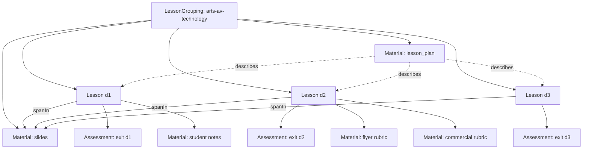

# Arts AV — T1 gold hasPart graph

Hand-built for graphing experiments (`docs/GRAPHING.md` tier T1).

## Placement rules encoded

| Resource | Graph role |
|----------|------------|
| Lesson plan `761e…` | Spine Material; `describes` d1–d3 |
| Slides `8943…` | Multi-day Material; Lessons `spanIn` by Day headers |
| Exit tickets (3 files) | `Assessment` `hasPart` of matching Lesson |
| Rubrics (2 files) | Materials `uses`d by d2 create activity |
| Student notes | Material used mainly on d1 |
| Flyer/commercial examples | `referenced_missing` |

## Tension to remember

Lab `calendar.yaml` still says **2** days; gold uses **3** Lessons because slides/plan mark Day 1/2/3. Graphing should surface that calendar/material disagreement rather than silently trust the thin calendar.

See `HAS-PART.json`.
